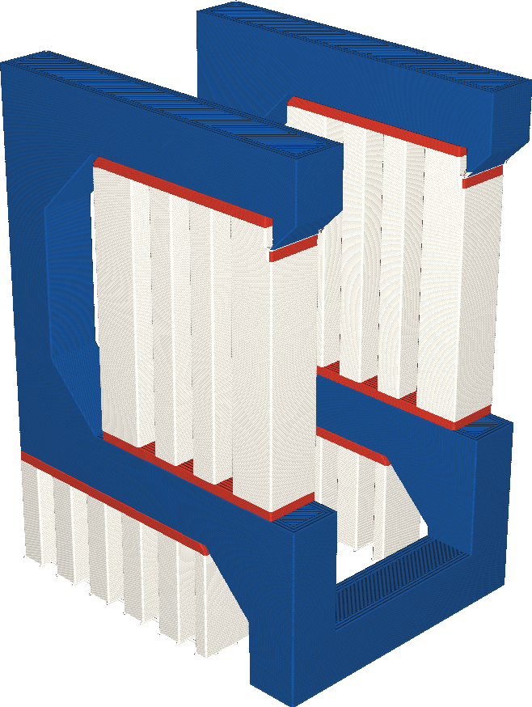

If your printer has multiple extruders, the interface layers where the support touches the model can be printed with a different extruder than the main body of the support. This setting allows you to choose which extruder is used for the support interface.

Some materials are better suited for printing support than others. For instance, they might not chemically adhere to the build material and then be easier to break off, or they might dissolve in water or alcohol. However such materials are often expensive and take longer to print. This setting allows you to choose the support interface with a different extruder than the main body, so that most of the support still prints fast and/or with cheaper materials, but the advantages of the specialised support material are still effective.

If you're using soluble materials to print the support interface, but insoluble materials to print the body of the support, keep in mind that the body may not be able to be removed from cavities if it's physically impossible to move the support body through a small opening. Where normally a soluble material can flow out through a cavity in solution, insoluble materials may not be able to go through.