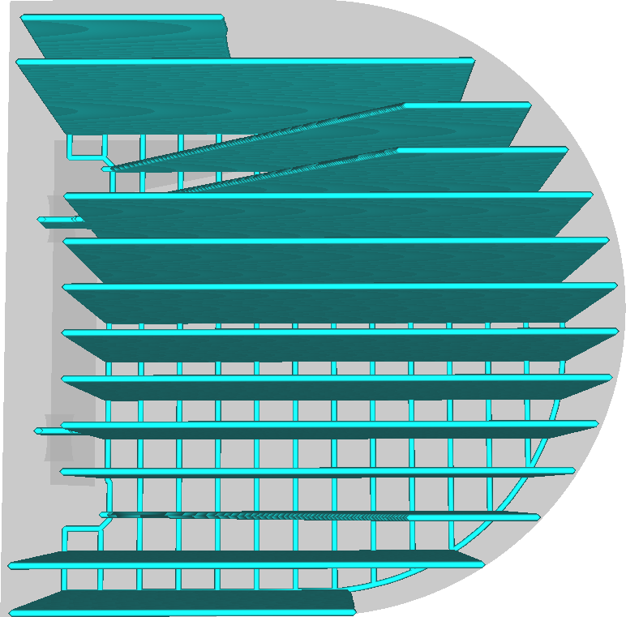
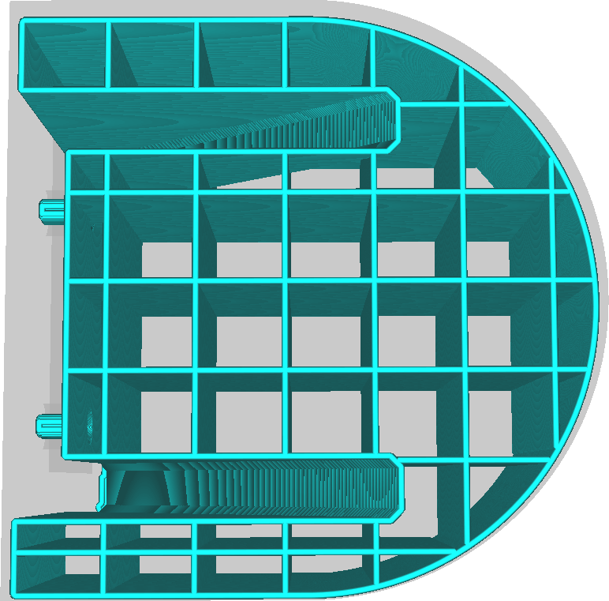
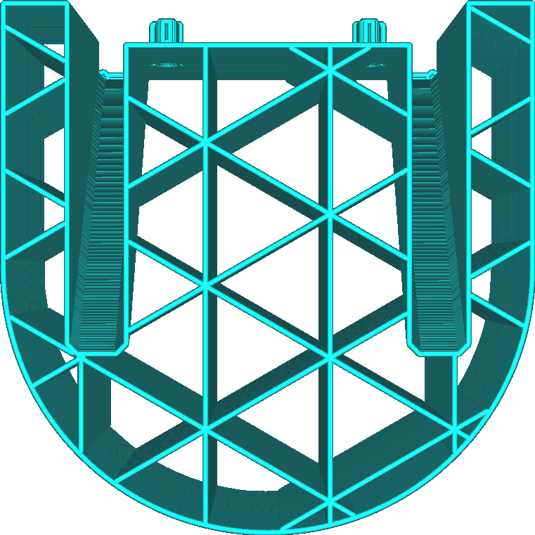
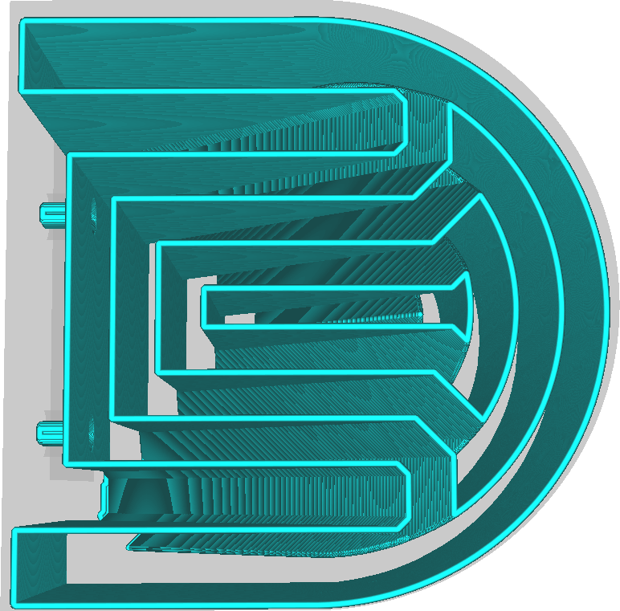
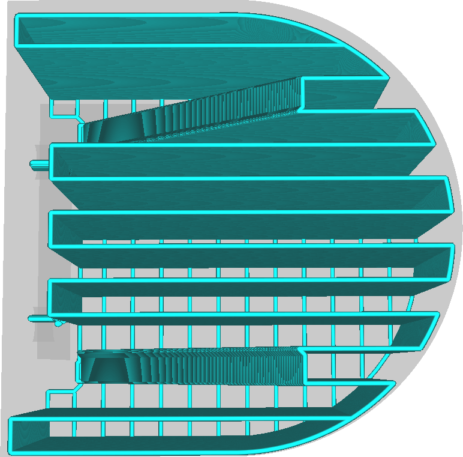
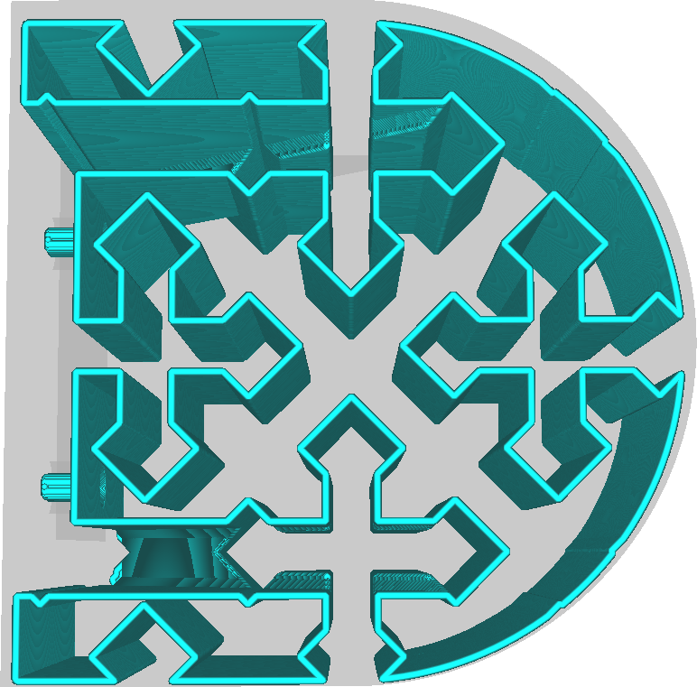
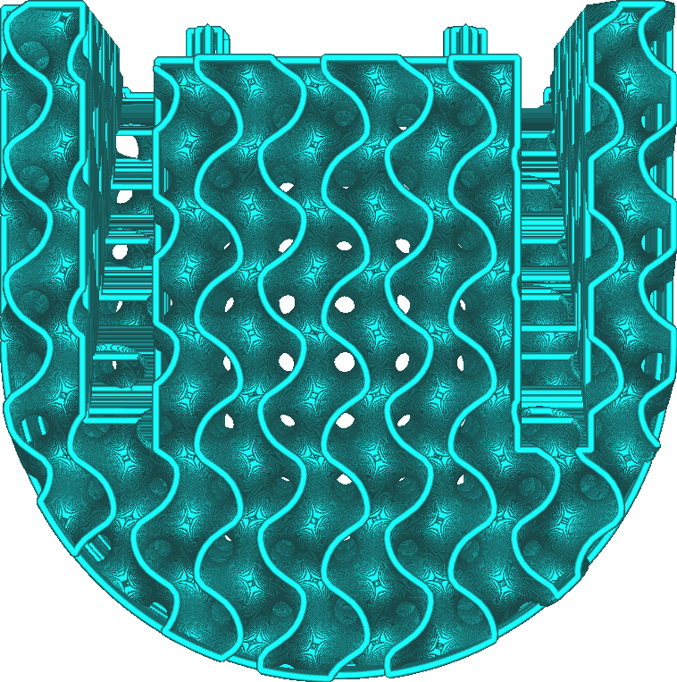

With this setting you can choose the pattern that will be used to fill the volume of the support structure. Different patterns have different strengths and weaknesses.

Lines
----

The lines pattern draws straight lines. The lines are oriented such that they are never perpendicular to the skin lines it needs to support (by default).
* Easiest to remove from the model of all patterns. This is very useful if there is an overhang area that is close to the build plate. A knife can be used to cut away the remnants if necessary.
* Provides the best overhang quality of all patterns together with Zigzag. The lines are very close together and oriented such that they are not perpendicular to the skin.
* Tends to be unstable, since the lines are prone to topple over.

Grid
----

The grid pattern draws two sets of straight lines perpendicular to each other. They overlap, forming a pattern of squares. By default, one perimeter is drawn around this pattern.
* Very sturdy, increasing reliably.
* Provides a mediocre overhang quality, since the lines are fairly far apart.
* Can be hard to remove, since the support will not flex much.

Triangles
----

The triangles pattern draws three sets of straight lines in 60 degree angles with one another, forming a pattern of equilateral triangles. By default, one perimeter is drawn around this pattern.
* The sturdiest of all support patterns.
* Provides bad overhang quality, since the lines are very far apart.
* Can be hard to remove, since the support will not flex at all in any direction.

Concentric
----

The concentric pattern causes the support to consist of concentric rings spaced evenly from the outside inwards.
* Lines are close together, providing good support of the overhang areas for a smooth surface, if the lines happen to be oriented perpendicularly.
* Fairly sturdy, since the loops individually have a large width to stand on.
* Easy to remove, since the support structure will bend inwards easily.
* Often ends up parallel to the walls it needs to support. This leads to worse overhang quality, since some walls don't get supported at all.
* Sometimes leads to support being suspended in mid-air.

Zigzag
----

The zigzag pattern is like the lines pattern, but the lines are connected on the ends.
* Fairly sturdy, greatly increasing reliability.
* Provides the best overhang quality of all patterns together with Lines. The lines are very close together and oriented such that they are not perpendicular to the skin.
* Easy to remove. The support structure bends inwards, and when pulling on it, the support will pull off in strips.
* Almost always draws the support in a single line, minimising the need for retractions or travel moves.

Cross
----

The cross pattern draws a fractional pattern throughout the volume with cross-like shapes in it.
* Easiest to bend of all patterns, since there are no long straight lines in this pattern.
* Almost always draws the support in a single line, minimising the need for retractions or travel moves.

Gyroid
----

The gyroid pattern is a wavy one, with a curve wiggling back and forth. The curve varies across the layers.
* Fairly sturdy pattern, increasing reliability.
* The air between the support is a single volume. When printing with soluble support materials, this allows the solvent (water, ethanol or otherwise) to protrude to all the innards of the support structure, even if there is a brim underneath. This allows it to dissolve the support faster.
* Supports all lines in the overhang evenly, regardless of their directions.

**This pattern is new in Cura 4.1.**