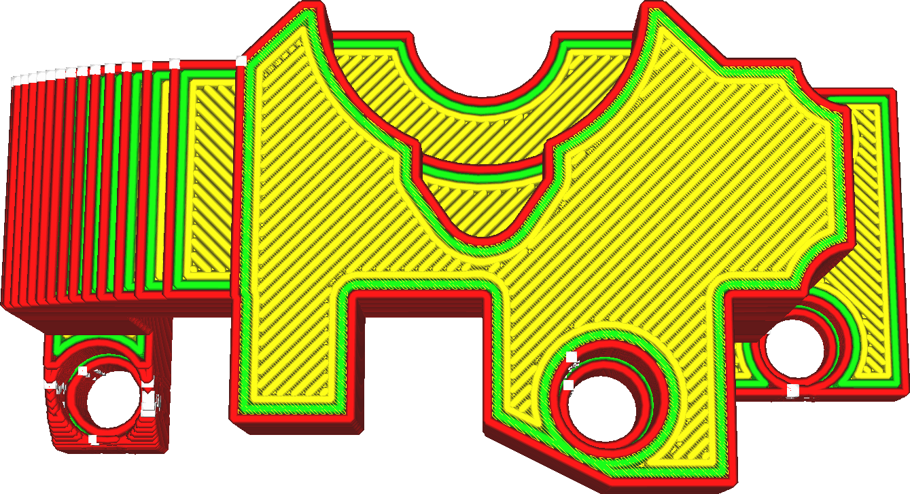

Iron Only Highest Layer
====
If this setting is enabled, ironing will only be applied to the very highest layer of the object. If your model has all sorts of top surfaces but only the highest is visible or only the highest needs to be smooth, then this setting enables you to save a lot of printing time.

<!--screenshot {
"image_path": "ironing_only_highest_layer.png",
"models": [
    {
        "script": "dial_brace.scad",
        "transformation": ["scale(0.5)"]
    }
],
"camera_position": [0, 14, 83],
"settings": {
    "layer_height": 0.2,
    "ironing_enabled": true,
    "ironing_only_highest_layer": true
},
"colours": 64
}-->

**If there are multiple objects in a print, the highest layer of every object will get ironed. This includes every part of a multi-extrusion print.**