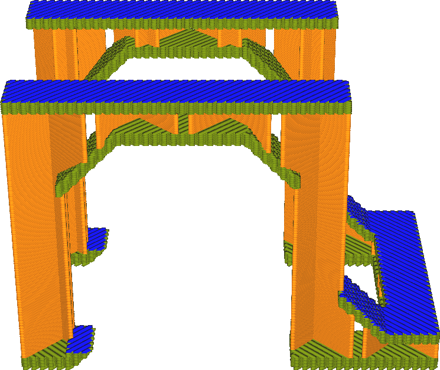

Top Surface Skin Layers
====
Part of the top of the print can be separated out and printed with different settings. This setting determines how big of a part to separate out. How many layers of the top of the print will get separate settings?

<!--screenshot {
"image_path": "roofing_layer_count.png",
"models": [
    {
        "script": "question_stick_clip.scad",
        "transformation": ["scale(0.5)"]
    }
],
"camera_position": [0, -90, 60],
"settings": {
    "wall_line_count": 0,
    "skin_outline_count": 0,
    "roofing_layer_count": 1,
    "speed_roofing": 10,
    "cool_min_layer_time": 1,
    "roofing_extruder_nr": 1
},
"colour_scheme": "speed",
"colours": 32
}-->

Some settings can greatly improve the quality of the top surface of the print, but they can make the print take much longer as they are applied to all skin layers at the top. A similar effect can be achieved by adjusting those settings only for the very top layer or two, but printing the rest of the skin layers faster. This will not have as big a negative effect on the printing time then.

Settings that can be adjusted for the top surface are:
* [Top Surface Skin Extruder](roofing_extruder_nr.md)
* [Top Surface Skin Flow](../material/roofing_material_flow.md)
* [Top Surface Skin Speed](../speed/speed_roofing.md)
* [Top Surface Skin Acceleration](../speed/acceleration_roofing.md)
* [Top Surface Skin Jerk](../speed/jerk_roofing.md)
* [Top Surface Skin Line Width](roofing_line_width.md)
* [Top Surface Skin Pattern](roofing_pattern.md)
* [Top Surface Skin Line Directions](roofing_angles.md)

To achieve a nicer top surface, try reducing the speed and increasing the jerk.

When printing the top surface in a different colour (using the [Top Surface Skin Extruder](roofing_extruder_nr.md) setting), it is often necessary to print more than one layer in the other colour. Otherwise the original colour will still bleed through.