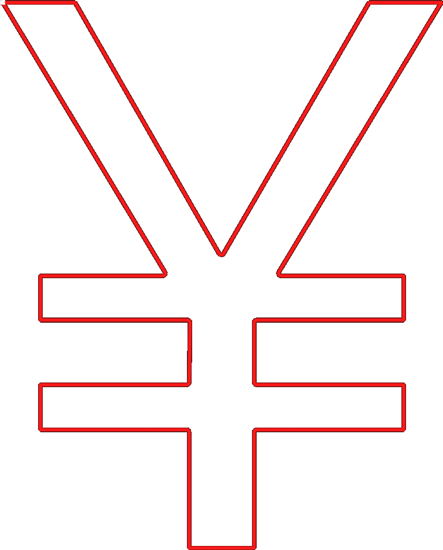

Monotonic Top/Bottom Order
====
Normally, Cura orders top/bottom lines such that the travel distance between them is small. If this setting is enabled, it will order the top/bottom lines such that adjacent lines are always printed overlapping in the same direction.

When printing top/bottom lines, the lines usually overlap a bit with the lines next to them, because the shape of a line is not a perfect rectangle. This overlap gives the lines a slight slope, causing them to reflect light differently in different directions. If adjacent lines overlap differently, this reflection changes. You can see this in the final result. It gives different areas of the surface a different shine. Printing in a monotonic order ensures that the overlap is the same on the entire surface, so there is no difference in how it reflects light. This makes the surface look more consistent and smooth.

<!--screenshot {
"image_path": "skin_monotonic_disabled.gif",
"models": [
    {
        "script": "yen.scad",
        "transformation": ["scale(0.5)"]
    }
],
"camera_position": [0, 0, 130],
"settings": {
    "wall_line_count": 1,
    "skin_outline_count": 0,
    "travel_compensate_overlapping_walls_enabled": false,
    "skin_monotonic": false
},
"layer": 1,
"line": [48, 68, 88, 108, 128, 148, 168, 180, 200, 220, 232, 276, 302, 334, 354, 374, 394, 422, 442, 472, 492, 521, 541, 556],
"delay": 125,
"colours": 32
}-->
<!--screenshot {
"image_path": "skin_monotonic_enabled.gif",
"models": [
    {
        "script": "yen.scad",
        "transformation": ["scale(0.5)"]
    }
],
"camera_position": [0, 0, 130],
"settings": {
    "wall_line_count": 1,
    "skin_outline_count": 0,
    "travel_compensate_overlapping_walls_enabled": false,
    "skin_monotonic": true
},
"layer": 1,
"line": [51, 71, 100, 120, 141, 161, 192, 212, 233, 253, 281, 309, 339, 367, 386, 406, 426, 446, 466, 486, 506, 526, 546, 557],
"delay": 125,
"colours": 32
}-->

The monotonic order will slightly increase the length of travel moves, but this effect is very minimal. It only has a visual effect on the print. There are no mechanical advantages to the monotonic ordering.

To achieve a smooth surface, consider pairing this setting with setting the [Combing Mode](../travel/retraction_combing.md) to avoid skin, and perhaps to enable [Z Hops](../travel/retraction_hop.md). Alternatively you could also enable [ironing](ironing_enabled.md), but that completely overrides the usefulness of this setting. Ironing has its own [monotonic option](ironing_monotonic.md).

