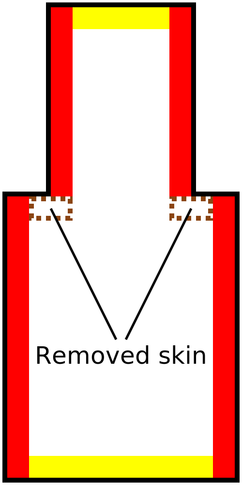

Skin Removal Width
====
This setting will remove very thin strips of skin, replacing them with infill instead.

The skin will only be removed if there is infill next to it, so it won't remove the skin at the very top or bottom of your print, even if that is very thin.

<!--screenshot {
"image_path": "skin_preshrink_original.png",
"models": [{"script": "stature_symmetrical.scad"}],
"camera_position": [104, -7, 4],
"settings": {
    "wall_line_count": 0,
    "infill_wall_line_count": 1,
    "bottom_skin_preshrink": 0,
    "top_skin_preshrink": 0,
    "max_skin_angle_for_expansion": 89
},
"colours": 32
}-->
<!--screenshot {
"image_path": "skin_preshrink_shrunk.png",
"models": [{"script": "stature_symmetrical.scad"}],
"camera_position": [104, -7, 4],
"settings": {
    "wall_line_count": 0,
    "infill_wall_line_count": 1,
    "bottom_skin_preshrink": 1,
    "top_skin_preshrink": 1,
    "max_skin_angle_for_expansion": 89
},
"colours": 32
}-->

Skin will normally get generated anywhere that is vertically close to the top or bottom of the object. This is not necessary everywhere. Vertical walls are usually strong enough, so while there should normally be skin next to vertical the vertical walls, this setting allows you to omit that. This saves on printing time and material.

For most prints, setting this to 1 or 2 line widths is helpful to reduce the printing time. Additionally, if the skin becomes too thin to print, Cura will leave a gap where the skin ought to have been (but was too small). The infill won't connect properly to the walls. If [Fill Gaps Between Walls](../shell/fill_perimeter_gaps.md) is enabled, these gaps will be filled up, but that method of filling takes more time to print than ordinary skin does. Setting this setting to at least the [Top/Bottom Line Width](../resolution/skin_line_width.md) prevents that from happening.

If the setting is increased too much, gaps can appear in the top and bottom surface where infill gets exposed. In particular, take good care with models that have thin ledges that should get a thin strip of skin.

<!--screenshot {
"image_path": "skin_preshrink_problem_screenshot.png",
"models": [{"script": "thin_ridge.scad"}],
"camera_position": [64, 0, 100],
"settings": {
    "wall_line_count": 3,
    "top_skin_preshrink": 5
},
"colours": 64
}-->

