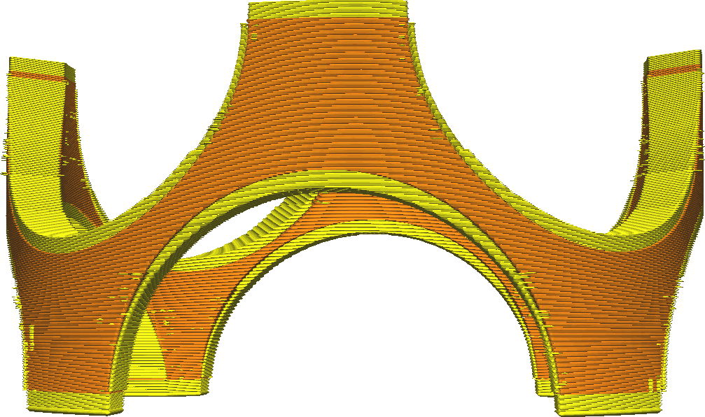
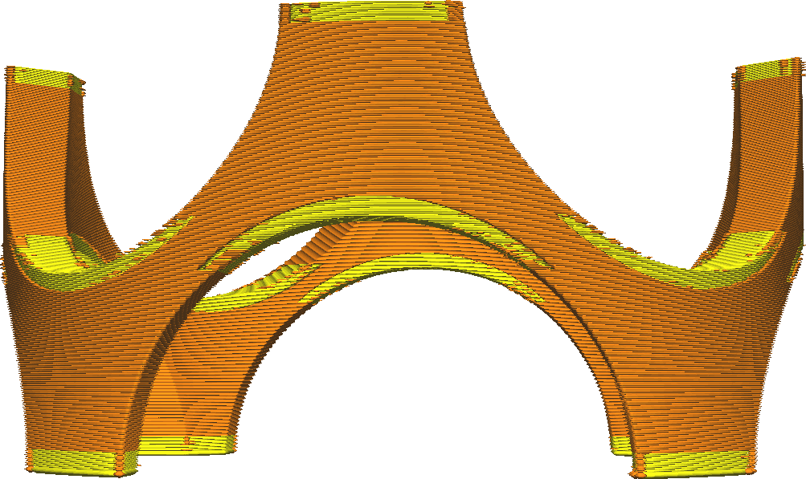

Top Skin Removal Width
====
Removes thin parts of the completely filled top layers, printing them with infill instead. This saves on printing time and material.

With steep surfaces the top layers will often become very thin. They are not necessary, since the horizontal strength of the walls is more than enough if the surface is almost completely vertical.

<!--screenshot {
"image_path": "skin_preshrink_original.png",
"models": [{"script": "stature_symmetrical.scad"}],
"camera_position": [104, -7, 4],
"settings": {
    "wall_line_count": 0,
    "infill_wall_line_count": 1,
    "bottom_skin_preshrink": 0,
    "top_skin_preshrink": 0,
    "max_skin_angle_for_expansion": 89
},
"colours": 32
}-->
<!--screenshot {
"image_path": "skin_preshrink_shrunk.png",
"models": [{"script": "stature_symmetrical.scad"}],
"camera_position": [104, -7, 4],
"settings": {
    "wall_line_count": 0,
    "infill_wall_line_count": 1,
    "bottom_skin_preshrink": 1,
    "top_skin_preshrink": 1,
    "max_skin_angle_for_expansion": 89
},
"colours": 32
}-->

Increasing this setting too much may result in the top side of tiny pieces being open, because it gets filled with infill instead of skin.