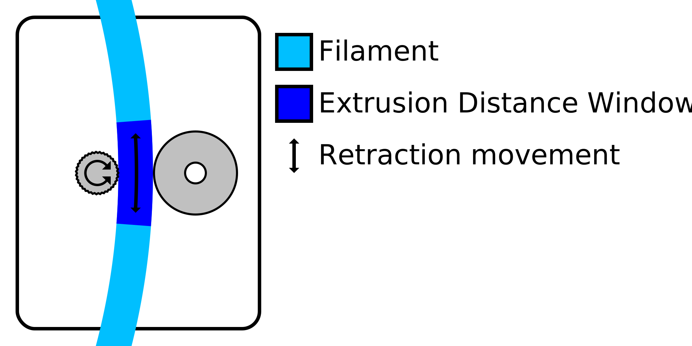

The feeder wheel needs to grip into the filament in order to move it properly. Retracting the material often tends to cause the feeder wheel to wear down the filament to the point where it can no longer grip the filament properly. This setting limits the number of retractions within a certain length of filament in order to prevent this grinding.

The retractions are limited by the combination of [Maximum Retraction Count](retraction_count_max.md) and this setting. The material is not allowed to be retracted more than the value of the Maximum Retraction Count within a length of filament indicated by this Minimum Extrusion Distance Window setting.

The length of filament during which the number of retractions is limited is a sliding window. For instance, with a window length of 3mm and a maximum retraction count of 10, this means that a new retraction is allowed as soon as the 10th retraction previous was made farther than 3mm back on the filament.

Increasing the length of the extrusion window effectively reduces the number of retractions. This makes the print more reliable, but increases the amount of stringing and blobs on the surface. This is especially useful for softer materials that are more sensitive to grinding.