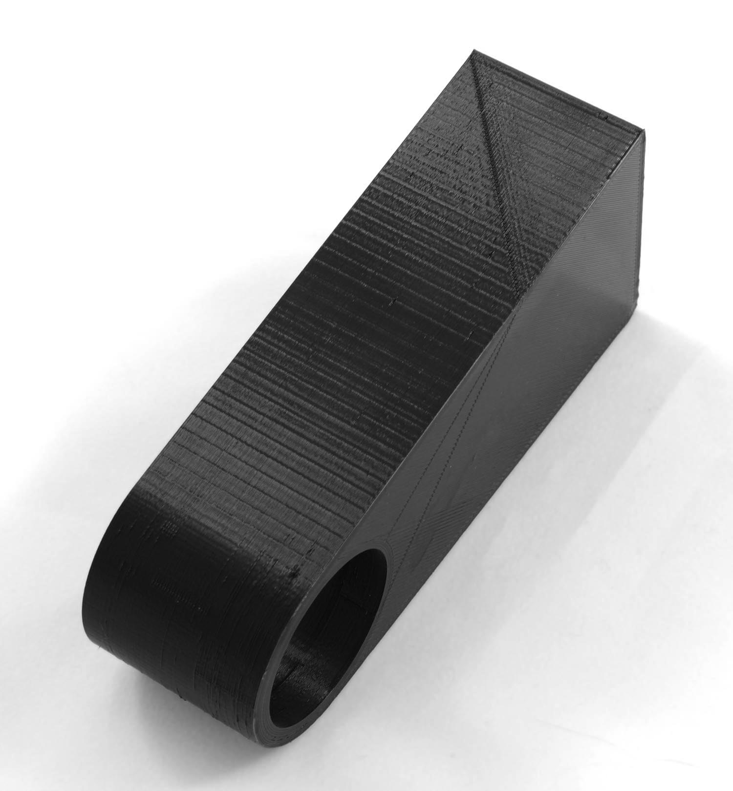

Stepper motors rotate in discrete steps. Their ability to rest in a position between those steps is limited. The step size of the motors serves as a limit to the resolution the printer can achieve. When printing walls that are almost, but not quite, aligned to the X or Y axis, this resolution sometimes shows as a pattern of lines.

The resolution of a stepper motor in a typical consumer 3D printer is in the range of 50 to 200 steps per millimetre. That makes the size of each step in the ballpark of 10 micrometres. If a line is drawn almost parallel with the other axis, say 0.5° away from orthogonal, then such a step will occur every 1.15mm along the line. This step itself is too small to be visible, but the vibrations are visible, especially if they resonate with the natural frequency of the frame.

Prevention
----
Stepper motors can choose between several strategies to turn their shaft, but it's a trade-off between resolution, torque and noise. Some firmware adjusts this automatically based on movement speed. Some firmware allows you to adjust this from the g-code as well. For instance, the g-code command `M350` can be placed in the start g-code to configure this manually. Cura (currently) has no method to configure this automatically based on the speed or structure.

The most reliable way to prevent this phenomenon though is to adjust the model such that the aliasing is not visible. Rotate your model such that the aliasing effect doesn't occur. If your model features an (almost) straight wall, make sure that it's either aligned completely with the axes, or angled several degrees away from it.