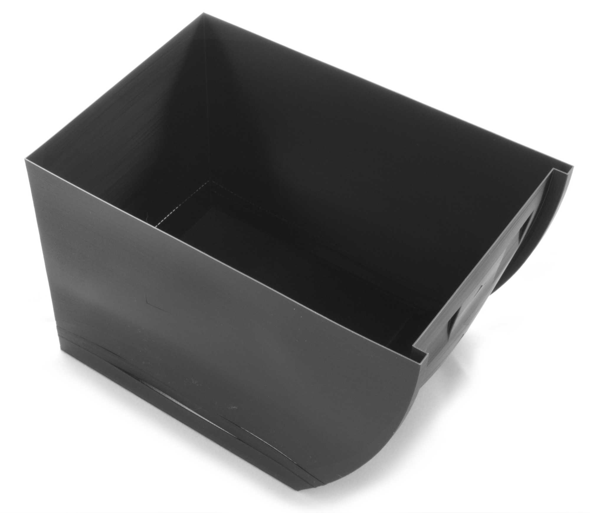

Layer Splitting
====
Adhesion between layers is often the greatest weak point in the structure of 3D printed objects. If the adhesion between layers fails during or shortly after printing, this is called layer splitting, layer separation or delamination.

Layer splits can be difficult to deal with, because the print will always split at the weakest link. The suggestions below are geared to make the print more consistent and extrusion more reliable, to remove weak links in the layer adhesion.

Warping
----
The majority of layer splits are caused by [warping](warping.md). This is especially prevalent with semi-crystalline polymers. Those will form microscopic crystal structures as they cool, and shrink a lot to form those structures. The most common form of warping is for the bottom of the print to warp upwards, which doesn't cause layer splits. However if the warping happens higher up in the print, it causes layers to bend away from their adjacent layers and split apart.

To prevent warping in higher layers, a number of things can be done specifically to reduce the chance of layer splitting:
* Use a concentric [Top/Bottom Pattern](../top_bottom/top_bottom_pattern.md). A linear pattern has lines that will all shrink in the same direction, which will pull those layers up in the same direction. The concentric pattern diffuses that force.
* Increasing the [Build Volume Temperature](../material/build_volume_temperature.md) reduces warping by [annealing](https://en.wikipedia.org/wiki/Annealing_%28glass%29) the plastic. To do this, the printer needs an enclosed build volume, keeping the heat in.
* Similarly, using a [draft shield](../experimental/draft_shield_enabled.md) keeps some of the heat in, albeit less effectively than an enclosed build volume.
* Prevent sharp corners in the 3D model. Adding a fillet to a sharp corner prevents the skin lines from tugging onto the underlying walls directly. This is often a spot where the layer split will occur.
* Use a material that doesn't shrink as much. For instance, PLA causes less warping than polypropylene. However, most people would choose their material for specific requirements, so this is not an option for them.

Insufficient Pressure
----
To make layers stick well to each other, it helps to push the plastic strongly on top of the previous layer. If the nozzle is not extruding enough material, or the material is not pushed hard enough against the previous layer, this reduces the adhesive force between the layers, allowing them to split more easily. Even if this doesn't cause a layer split immediately, it also reduces the strength of the final part.

This is mainly a problem for the walls. The skin has so much surface area that it is not prone to split. Between infill and walls, the walls provide the majority of the layer adhesion since infill is often printed very fast, using sparsely distributed lines and often not vertically stacked.

To ensure sufficient pressure, it's important to make sure there is no [underextrusion](underextrusion.md). All causes of underextrusion are applicable, but a couple of them are of particular concern for layer splitting:
* When pausing the print halfway, it takes a while to get the extrusion up to speed again. The Pause at Height script has an option to <!--if cura_version >= 4.7-->redo a layer<!--endif--><!--if cura_version < 4.7:redo the last few layers-->. This will prime the material before continuing upwards, preventing a weak layer with insufficient nozzle pressure.
* Reducing the [Wall Printing Speed](../speed/speed_wall.md) makes the walls print more consistently. This reduces the chance of developing weak points, while also reducing underextrusion on the walls.
* Reduce the [Layer Height](../resolution/layer_height.md) or the [Wall Line Width](../resolution/wall_line_width.md). High flow rates need greater pressure. If the printer is unable to provide that, insufficient material will be extruded to fill the thick layers or wide lines. This makes the print weaker.
* Increase the [Printing Temperature](../material/material_print_temperature.md) to ensure the material flows out more widely, making full use of the contact area, rather than staying concentrated in the centre of the line.
* Reduce the [length of retractions](../travel/retraction_amount.md). Long retractions allow more material to leak during the retraction, causing underextrusion later. They also interrupt the flow more. It will take more time for the flow to stabilise afterwards. Reducing the retraction length reduces the chance of a weak link developing along the height of the print due to inconsistent flow.

Insufficient Surface Area
----
The adhesion between layers is a function of the strength of the bonding between materials multiplied by how much surface area there is to bind to. Increasing the surface area helps to reduce the chance of layer splitting.

The most important parameter for this is the [Wall Thickness](../shell/wall_thickness.md). More walls drastically increases the surface area. Walls are printed more slowly and are situated at the point where it will start splitting, so they are a very effective way to increase layer adhesion. However printing more walls also drastically increases the printing time and material usage.

Insufficient surface area is often a problem when printing large prints, where warping is strong, with just a single wall and no infill. The wall will start to buckle due to warping and there is nothing to stop it. This might be a reason to disable the use of [spiralize mode](../blackmagic/magic_spiralize.md), since it prints just a single wall and prevents infill from being generated. Instead, you might need to print with two walls and manually set the infill density to 0% to achieve a similar effect.

Incompatible Materials
----
In prints featuring different types of plastic, make sure that the plastics adhere to each other. Typically plastics with greatly different shrinkage ratios will not be able to stick to each other. Different chemical effects will also cause plastics to repel one another, preventing them from sticking. If this happens in a large flat area in the middle of your print, chances are that the print will come apart there.

To prevent this from happening, it may be necessary to design a mechanical interlocking joint between the two surfaces. Treat the different materials as if they are printed separately, except they won't need to be assembled later.