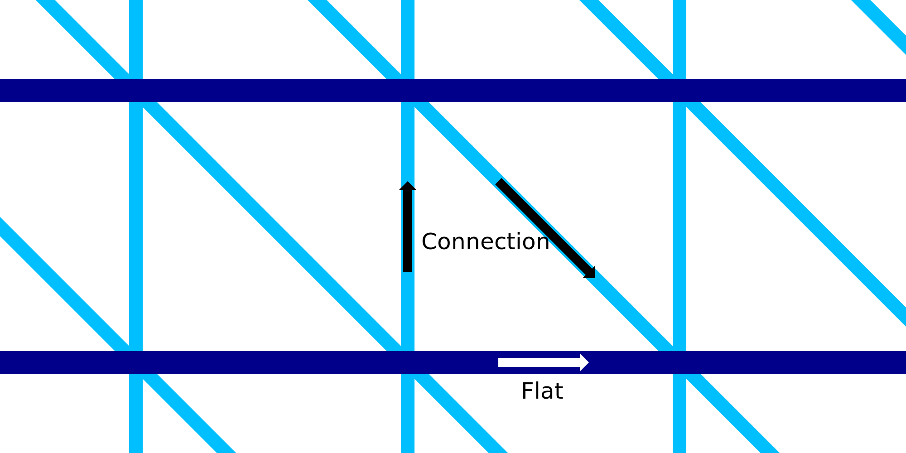

This setting configures the flow rate (and thereby the thickness of the wires) of the upwards and downwards connecting wires in the wire frame structure. This can be configured separately from the horizontal rings.

Increasing the flow makes the wires thicker. This makes the connections more rigid once they have solidified. However it also increases the heat mass of the wires, making them take longer to solidify. This reduces the reliability of the print, since the wires may not connect properly any more then.