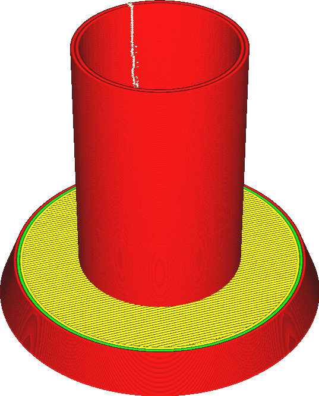
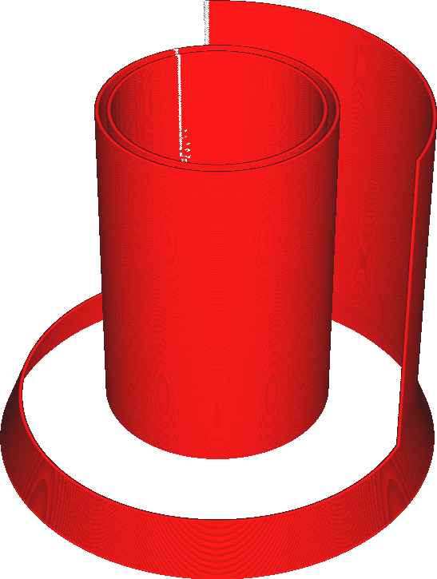
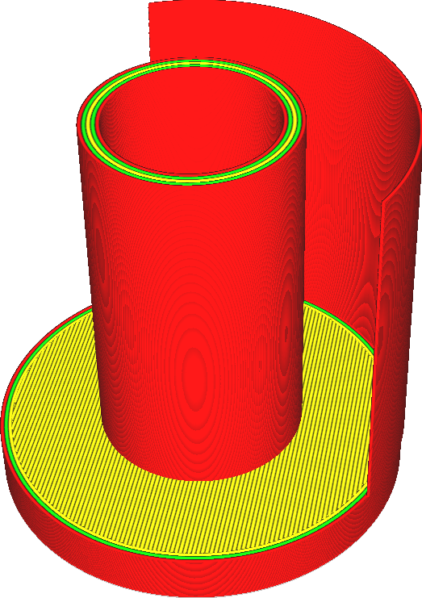

Povrchový režim
====
Cura obvykle vytváří průřezy všech trojúhelníků ve vaší síti. Tyto úsečky jsou vzájemně spojeny a vytvářejí smyčky. Smyčky, které nejsou uzavřeny, budou odmítnuty.

Tento parametr řídí, co se bude dělat s těmito neuzavřenými smyčkami. Pokud je tento parametr nastaven na "Normální", budou odmítnuty. Pokud je nastavena na "Povrch", všechny průřezy se vytisknou jako obrysy. Pokud je parametr nastaven na "Oba", uzavřené obrysy se tisknou normálně, ale neuzavřené obrysy se tisknou samostatně jako další stěny.

Další oblasti určené k tisku budou zahrnovat pouze svislé oblasti jako jednotlivé linie. Neexistuje žádná technika výplně pro vodorovné povrchy, protože povrchy nejsou uzavřenými mnohoúhelníky. Nelze je naplnit, protože neexistuje žádný interiér. Nesmí existovat žádná horní, dolní, výplň nebo podpěra. Pouze jednoduché linie.

Další povrchy budou vytištěny, jako by šlo o vnější stěny, takže budou ovlivněny rychlostí tisku vnějších stěn, šířkou linií atd. Tyto povrchy se také vytisknou pomocí linie, která je přesně vystředěna na povrchu a ne zarovnáním linie podél vnitřku modelu. To znamená, že se povrch rozprostírá s poloviční šířkou linie po obou stranách povrchu. To se děje proto, že je nejasné, která strana povrchu je uvnitř modelu. Váš tisk nebude rozměrově přesný. Pokud je stejně jako na výše uvedeném snímku zarovnaný s normálním pevným povrchem a používáte k dokončení chybějících stěn možnost „Oba“, nebudou vrstvy správně zarovnány.

**Pokud tisknete jak normální objemy, tak další povrchy, mějte na paměti, že objemy budou vytištěny s vnější stěnou zcela uvnitř objemu. Další oblasti jsou vytištěny s linií vystředěnou na oblasti, s polovinou šířky linie na každé straně. Pokud je další povrch zarovnán s povrchem uzavřeného objemu, jako na obrázcích výše, bude povrch odsazen o půl linie. Koneckonců, další povrch nemá žádný interiér, do kterého by se mohl přesunout.**