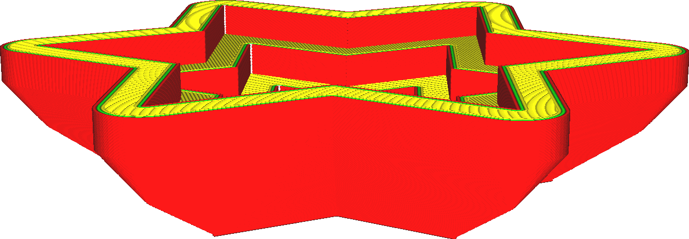

Úhel formy
====
Podobné funkci [Učinit převis tisknutelný](../experimental/conical_overhang_enabled.md), tento parametr mění tvar forem tak, aby mohly být vytištěny bez podpěry. Změní se pouze vnější tvar formy, takže tvar vašeho odlitku nebude ovlivněn.

U některých tvarů nestačí modifikovat vnější tvar formy, aby se tiskla správně. Bude stále muset poskytnout podpěru. Podobného efektu můžete dosáhnout aktivací parametru [Aktivovat kónické podpěry](../experimental/support_conical_enabled.md).
