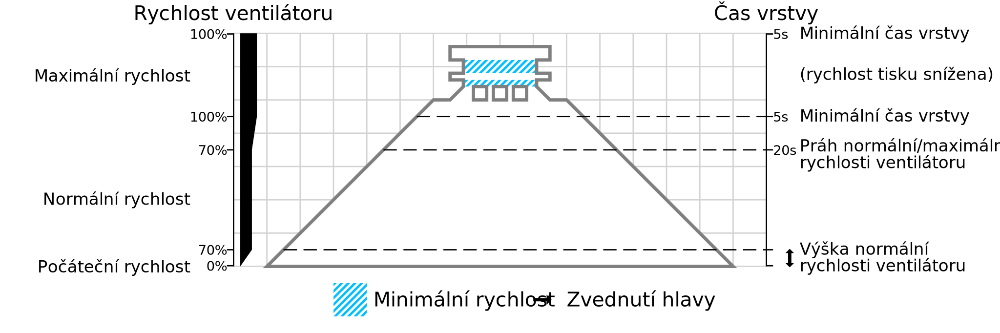

Výška normální rychlosti ventilátoru
=====

Rychlost ventilátoru začíná na hodnotě parametru [počáteční rychlost ventilátoru](cool_fan_speed_0.md) na začátku tisku. Během prvních vrstev tisku, dokud nedosáhne výšky uvedené v tomto parametru, bude rychlost ventilátoru postupně zvyšována až do [normální rychlosti ventilátoru](cool_fan_speed_min.md).

* Zvýšení tohoto nastavení může zlepšit přilnutí k tiskové podložce.
* Snižte toto nastavení, pokud si všimnete problémů s sloní nohou nebo výtokem.
* Pokud je vaše podložka tisku zahřáta na vysokou hodnotu, možná budete muset toto nastavení omezit, abyste se vyhnuli sloním nohám nebo výtokům.
