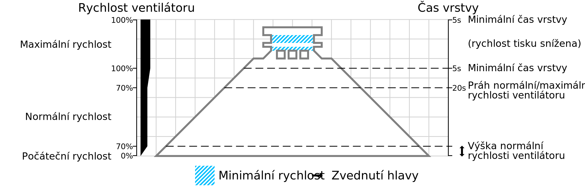

Práh normální/maximální rychlosti ventilátoru
====
Tento parametr určuje dobu tisku vrstvy, která je tak krátká, že se rychlost ventilátoru začíná zvyšovat a dosahuje hodnoty [maximální rychlosti ventilátoru](cool_fan_speed_max.md). Vrstvy, které se tisknou déle, budou používat [normální rychlost ventilátoru](cool_fan_speed_min.md). U vrstev s kratší dobou tisku bude rychlost ventilátoru interpolována mezi parametry normální a maximální rychlosti ventilátoru, až do [minimální doby trvání vrstvy](cool_min_layer_time.md), kde bude rychlost ventilátoru na nejvyšší hodnotě.

Účinné snížení této prahové hodnoty (směrem ke kratším vrstvám) způsobí, že se ventilátor bude častěji otáčet při běžných otáčkách ventilátoru. Zvýšení této prahové hodnoty způsobí častější otáčení ventilátoru při vyšších rychlostech, i když vrstvy nejsou příliš malé.

Je dobré dodržovat určitou vzdálenost mezi minimální dobou vrstvy a touto normální/maximální prahovou hodnotou rychlosti ventilátoru. Pokud je prahová hodnota nastavena na minimální dobu vrstvy, ventilátor se náhle zastaví, pokud se vrstvy stanou mírně pod prahovou hodnotou. To způsobí viditelné pruhy na povrchu tisku, protože tam je tvrdý okraj, kde se ventilátor náhle rozvinul. Pokud je místo toho mezi těmito dvěma nastaveními nějaký rozdíl, bude změna rychlosti ventilátoru pozvolnější a pruhy nebudou v tisku viditelné.