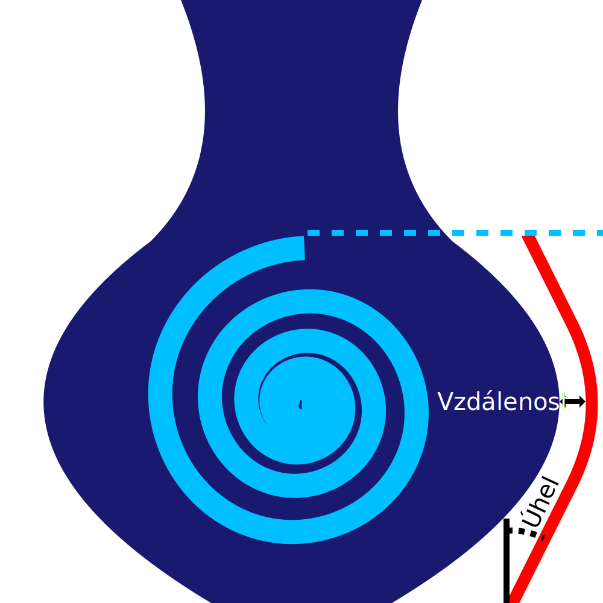

Povolit štít proti výtoku
====
Když tisknete s více extrudéry, obsahují někdy neaktivní extrudéry stále nějaký materiál. Pokud jsou trysky stále horké, má tento materiál tendenci vytékat. Toto je problém, kterému má štít proti výtoku zabránit. Štít proti výtoku je ohraničení kolem předmětu, které zachycuje jakýkoli výtok pod tryskou.

Štít proti výtoku se vytiskne do výšky nejvyššího přepnutí extrudéru. Za touto výškou se po přechodu do pohotovostního režimu nebude pohybovat žádná tryska, takže ochranný štít není třeba tisknout. Štít proti výtoku bude vytištěn extrudérem, který začíná na vrstvě. Tento extrudér bude střídat každou vrstvu, což je nebezpečné při práci se dvěma různými materiály, které se navzájem dobře nelepí. Avšak následující tisk, když se druhý extrudér aktivuje, z velké části ničí účinek ochranného štítu.

Ochranný štít je dostatečně tenký na to, aby se snadno rozbil nebo odřízl, a udržuje svou vzdálenost od modelu, takže ho můžete odstranit bez zanechání jizev na povrchu.
