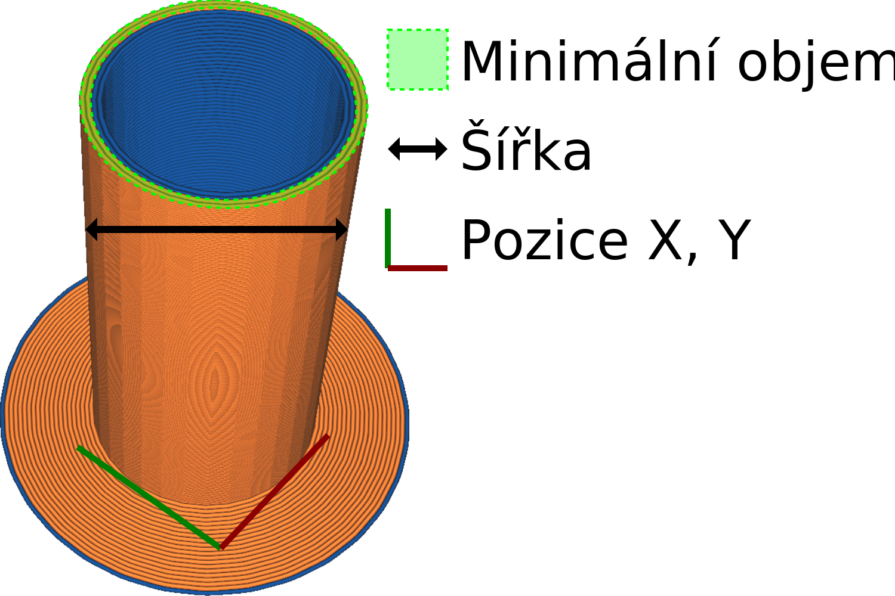

Pozice X aktivační věže
====
Toto nastavení umožňuje aktivační věže přemístit. Označuje souřadnici X rohu aktivační věže.

Tyto souřadnice neoznačují střed aktivační věže, ale roh s nejnižšími souřadnicemi X a Y.
