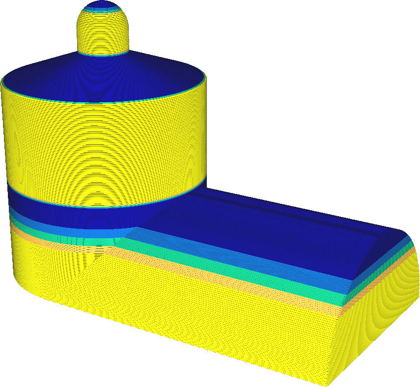

Velikost kroku variace adaptivní vrstvy
====
Pokud je požadovaná tloušťka vrstvy velmi odlišná od tloušťky sousední vrstvy, bude na výstupu z trysky velký rozdíl v rychlosti toku, což může způsobit nad-extruzi nebo pod-extruzi. Toto nastavení zajišťuje, že rozdíl v tloušťce vrstvy je postupná změna, aby se tomu zabránilo. Pomocí tohoto parametru můžete určit maximální změnu tloušťky vrstvy mezi dvěma sousedními vrstvami.

Snížení tohoto parametru si vynutí postupnější přechod tloušťky vrstvy. To má řadu vlivů na tisk:
* Během přechodu na nižší tloušťku vrstvy bude méně nad-extruzí, protože tok opouštějící trysku má určitý čas na přizpůsobení nižšímu průtoku. Tím se zabrání kapkám na povrchu.
* Stejně tak bude při přechodu na větší tloušťku vrstvy méně pod-extruzí, protože tok opouštějící trysku se může postupně přizpůsobovat většímu průtoku.
* Pruhování budé méně viditelné. Ačkoli oblasti s různou tloušťkou vrstvy budou mít vždy odlišnou strukturu a barvu, tyto oblasti jsou nyní od sebe vzdálenější, což ztěžuje jejich viditelnost.
* Pokud je v modelu ostrý úhel, který by měl způsobit náhlý přechod do tenčích vrstev, znovu se objeví efekt topografie. Tloušťka vrstvy nemůže být nastavena tak rychle, a proto bude pro mělké povrchy nutné použít silnější vrstvy.
* Podobně, když by ostrý úhel modelu měl způsobit náhlý přechod na silnější vrstvy, vytvoří tiskárna zbytečně tenké vrstvy, a ztratí čas tisku, pokud to není nutné.

Vzhledem k implementaci algoritmu adaptivní vrstvy dojde k postupnému přechodu na jinou tloušťku vrstvy *vždy nad* úhlem v modelu, který způsobil přechod.

