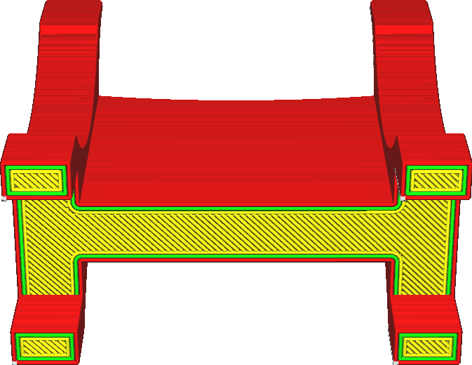

Aktivovat nastavení přemostění
====
Pokud má váš model určitý převis, který je podporován na obou stranách, Cura ho detekuje a upraví oblast pláště převisu tak, by se mohla tisknout lépe. Pokud je toto nastavení povoleno, můžete upravit detekci těchto přemostěných oblastí a výsledné chování tak, aby došlo k lepšímu přemostění.

Běžně bude Cura používat techniku přemostění. Cura detekuje převislé oblasti pláště, které jsou podpírány na více stranách. [Směr těchto linií pláště](../shell/skin_angles.md) je upraven tak, aby tyto oblasti automaticky propojil. Tím je zajištěno, že největší možná část převislé oblasti je podporována na více stranách a zvyšuje se kvalita tisku.

Pokud je však toto nastavení povoleno, můžete toto chování doladit tak, aby vyhovovalo vašim potřebám. To vám umožní provádět změny:
* rychlost tisku
* tok
* hustotu (jako hustota výplně, ale s liniemi pláště)
* rychlost ventilátoru
* pro stěny, také doběh

Tyto parametry lze nastavit samostatně pro plášť, který překlenuje mezeru, a také pro stěny. Pokud je aktivována možnost [Přemostění má několik vrstev](bridge_enable_more_layers.md), lze je také upravit samostatně pro druhou a třetí vrstvu nad mezerou přemostění. Je také možné upravit části tisku, které jsou považovány za přemostěné oblasti, nastavením [jaký zlomek zóny musí být nad vzduchem](bridge_skin_support_threshold.md) a [minimální šířky stěn](bridge_wall_min_length.md).

Aktivací parametru přemostění máte lepší kontrolu nad tím, jak jsou v tisku ošetřena přemostění. Velmi dobrým nastavením parametrů přemostění můžete výrazně zlepšit kvalitu převisů a zlepšit přesnost ve svislém směru. Jedinou nevýhodou je, že pokud neupravíte nastavení přemostění podle vaší tiskárny, může být tisk ještě horší.

