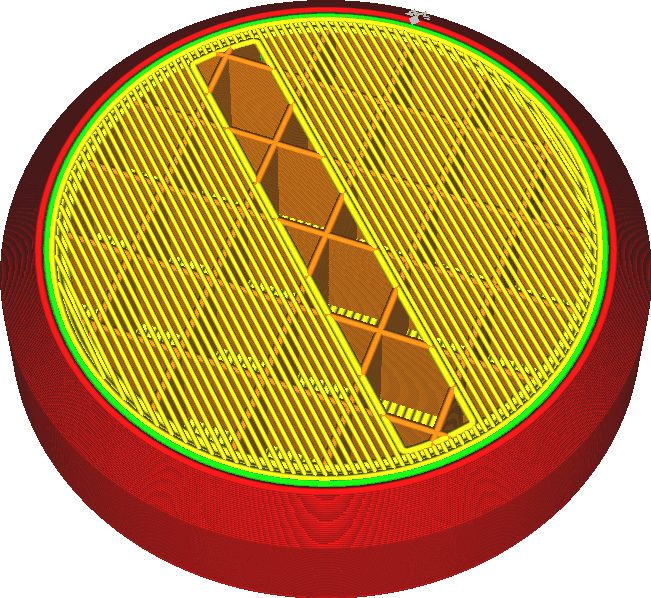

Maximální hustota výplně přemostění
====
Pokud tisknete s velmi nízkou hustotou výplně, má horní plášť tendenci klesat, což způsobuje [polštáře](../troubleshooting/pillowing.md) a obecně obecně nepravidelné povrchy na horní straně tisku. Případně lze přemosťovací techniky aplikovat také na horní plášť. Tento parametr se používá ke konfiguraci rychlosti výplně, při které se začne používat technika přemostění.

Tento parametr je nakonfigurován jako práh, aby profily mohly obsahovat jednu hodnotu. Zatímco uživatel nastavuje hustotu výplně po celou dobu, přemostění pro plášť bude automaticky povoleno nebo zakázáno.

Překlenutí pro horní plášť obecně vytváří hladší horní povrch při velmi nízkých výplních. Ujistěte se však, že pokud použijete tuto techniku, je dost [horních vrstev](../shell/top_layers.md), aby bylo možné povrch řádně uzavřít bez použití techniky přemostění na nejvyšších vrstvách. Technika přemostění, zejména se sníženou [šířkou linií](bridge_skin_material_flow_3.md), povrch úplně nezavře. Pokud nemá horní plášť dostatek vrstev, skončí to s otvory v tisku a se sníženou silou.
