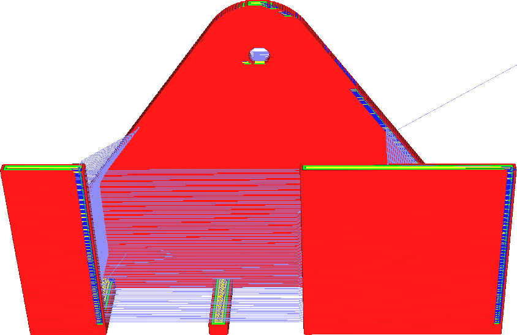

Objem doběhu
====
Tento parametr určuje, jak daleko před koncem obrysu podavač zastaví podávání materiálu. Délka vlákna je však konfigurována jako objem materiálu. Úzce souvisí s objemem uvnitř tryskové komory.

Zvýšení doběhového objemu způsobí, že se tryska přestane vytlačovat dále, než dokončí obrys. Výsledkem je, že ke konci bude více pod-extruzí. Funkcí doběhu je kompenzovat kapku, když je kontura propojena, takže zvyšování objemu doběhu může kompenzovat větší kapky.

Přílišné zvětšení doběhového objemu však způsobí tvrdou pod-extruzi směrem ke konci obrysu. To může dokonce vést k určité pod-extruzi v čemkoli, co je vytištěno po obrysu, protože tlak na trysku je pak stále nízký.