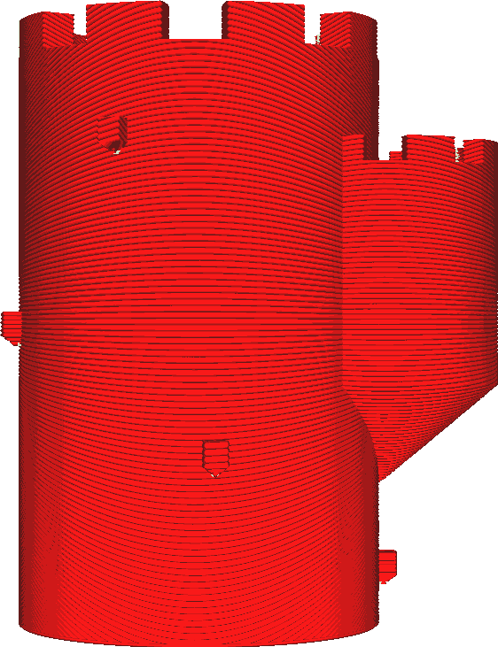
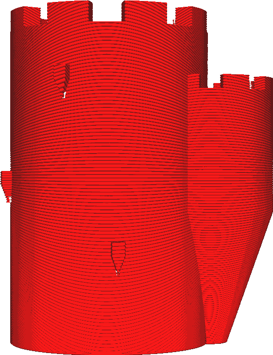

Maximální úhel modelu
====
S tímto parametrem je úhel převisu nakonfigurován (ve stupních) tak, aby [umožnil tisk převisu](conical_overhang_enabled.md). Zvětšení tohoto úhlu poskytuje větší převis, což znamená, že Cura model méně modifikuje. Zmenšení tohoto úhlu vám umožní, aby žádný převis vůbec nebyl.

Úhel 90° ponechá model tak, jak byl se svým přesahem. Model se nezmění. Úhel 0° způsobí, že všechny svahy budou zcela svislé.

Zmenšením tohoto úhlu se sníží přesah modelu. To usnadňuje tisk modelu. Nebude se příliš prohýbat, a proto bude povrch spodních stran hladší. To však také učiní tištěný objekt méně věrným původnímu modelu. Tisk bude také trvat trochu déle a spotřebuje více materiálu.

Úhel může být také záporný. Díky tomu je celý tisk kónický se širokou základnou. To může vyvolat zajímavé efekty, ale nemá to skutečné praktické využití.