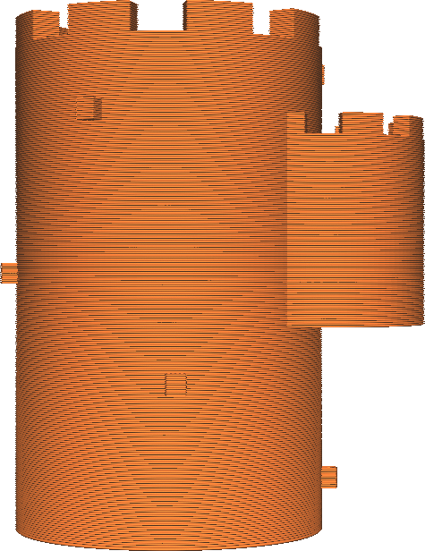

Učinit převis tisknutelný
====
Toto nastavení změní váš model tak, aby již neměl převis. Pod každý převis umístí další materiál a vytiskne ho, jako by byl součástí modelu.

Pod všemi převislými částmi je umístěn materiál, který se postupně směrem dolů zmenšuje. V mnoha případech bude převis skloněn směrem k samotnému objektu. Sklon, ve kterém je přesah vytvořen, aby rostl směrem k objektu, je určen [úhlem modelu](conical_overhang_angle.md).

Toto nastavení může být snadným způsobem, jak se vyhnout nutnosti podpěry. To je zvláště účinné při tisku modelů, jejichž povrchy nebo reliéf stran jsou poněkud drsné. Tyto malé části převisu by se měly normálně prohýbat a vytvářet prameny odpojené plastové struny. Mohou být podpírány nějakou podpěrou, ale to může být nákladné na dobu tisku a stále to zanechá jizvy. Pokud je toto nastavení povoleno, bude převis vyhlazován směrem k modelu. Zdá se, že takto by mělo být vytištěno.

Pokud přesah vyčnívá dále od hlavního těla, než je jeho šířka, mohlo by to stále ještě způsobit nějaký přesah ve formě linie. To se děje proto, že výstupek je pak nekonečně tenký a způsobuje jeho zmizení. Pokud k tomu dojde, můžete zvážit, zda bude stále nutné tisknout podpěru. V případě výše uvedených obrázků se to stane s malými bloky na straně věže, ale jsou tak malé, že jejich vytvoření pravděpodobně umožní jednoduché přemostění.