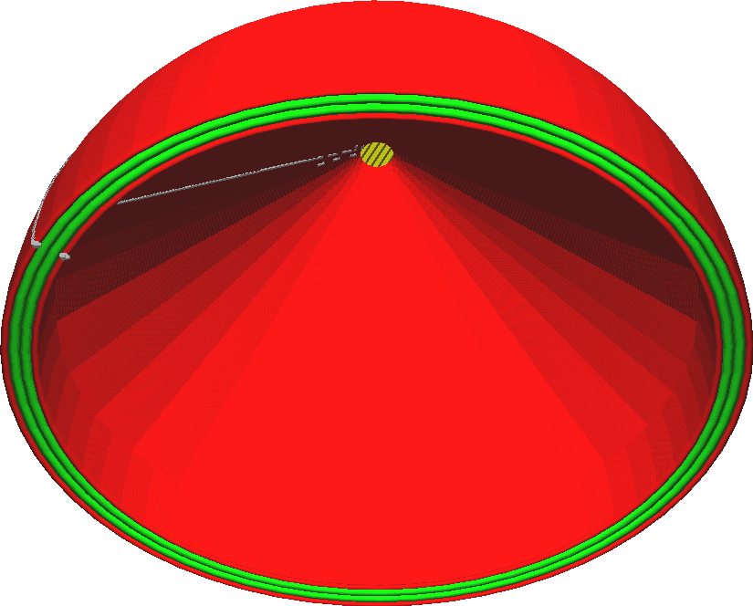

Maximální plocha převislého otvoru
====
Protože [Učinit převis tisknutelný](conical_overhang_enabled.md) odstraní jakýkoli převis, všechny mosty se automaticky sníží a uzavřou převis pod ním. Pokud je však převis uzavřen ze všech stran, bude se snižovat, dokud nebude uzavřený převis zcela zaplněn. Veškeré otvory směřující dolů se tak zcela vyplní, i když převis, který je třeba odstranit, je jen malý bod úplně nahoře.

Aby se tomuto efektu zabránilo, umožňuje toto nastavení, aby převis zůstal otevřený, pokud je ze všech stran uzavřený a menší než určitá plocha. To platí pouze pro otvory. Pravidelný přesah na vnější straně modelu je stále prodloužen směrem dolů, aby byl zachován přiměřeně tisknutelný úhel.

U většiny modelů je zcela bezpečné nastavit toto hodnotu na několik desítek milimetrů čtverečních. Pokud je nastaveno příliš nízko, model se více upraví, aby podporoval přesahy, které jsou skutečně příliš malé na to, aby potřebovaly nějakou podpěru. Pokud je však nastaveno příliš vysoko, vzniknou značné plochy přesahů, které by mohly být obtížně překlenutelné.

Pokud jsou v důsledku tohoto nastavení velké oblasti s přesahem, je dobré se nejprve podívat na [vyladění přemostění](bridge_settings_enabled.md), než se pokusíte model upravit a přesah odstranit.