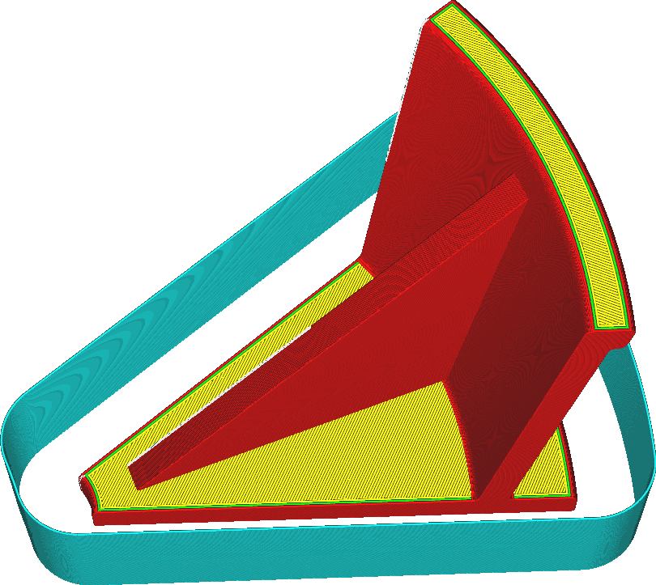

Omezení ochranného štítu
====
Ochranný štít lze vytisknout buď na celou výšku modelu nebo pouze na určitou výšku. Tento parametr umožňuje zvolit výšku ochranného štítu.

Spodní strana tisku bývá nejcitlivější na kolísání teploty. To je místo, kde nastává většina deformací, pokud je místnost studená, a toto deformování může způsobit, že tisk opustí podložku tisku. S tímto nastavením můžete zvolit omezení výšky štítu proti průvanu na určitou výšku. To může ušetřit nějaký čas a materiál. Ochranný štít bude potom stále chránit spodní stranu tisku a bude také blokovat proudění vzduchu v důsledku nárůstu horkého vzduchu (do určité míry).

Ochranný štít nemůže být nikdy vytištěn výš než samotný objekt.
