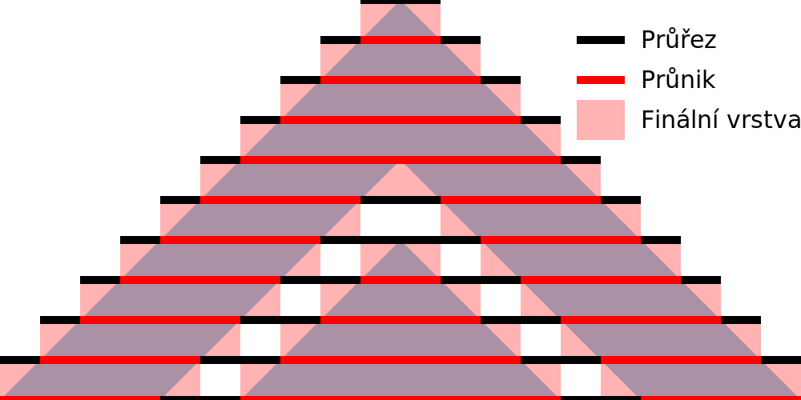
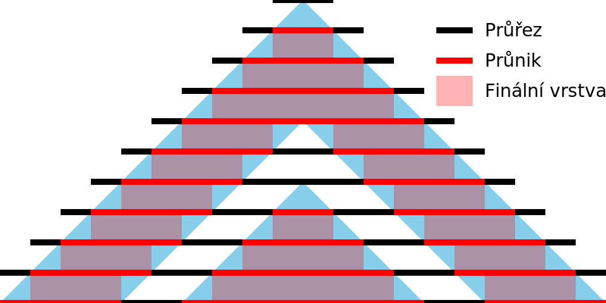

Tolerance slicování
====
Díky toleranci slicování můžete upravit způsob zpracování nepřesnosti dělení sítě na konečný počet vrstev. To vám umožní zvolit, zda se vrstvy mají přiblížit k povrchu, zůstat ohraničeny povrchem nebo zcela zahrnout povrch.

Střední
----

Při použití Střední, zůstanou vrstvy co nejblíže původnímu povrchu. To znamená, že vrstvy někdy vyčnívají z původního povrchu a někdy klesají do původního povrchu. Celkově bude objem vrstev velmi těsně odpovídat objemu původní sítě.

K dosažení Střední tolerance vypočítá Cura průřez v polovině tloušťky každé vrstvy. Vše uvnitř průřezu bude součástí vrstvy.

Inkluzivní
----

Při použití Inkluzivní zahrnují vrstvy *alespoň* celý původní objem. Když je povrch nakloněn, vrstvy mírně vyčnívají. Celkový objem vrstev bude téměř vždy větší než objem původní sítě.

K získání Inkluzivní tolerance vypočítá Cura průřezy v horní a dolní části výšky každé vrstvy. Všechny povrchy, které jsou v *jednom* z těchto průřezů, budou považovány za součást této vrstvy. Malé detaily, které leží mezi dvěma průřezy, budou vždy ignorovány a budou menší než výška vrstvy.

Exkluzivní
----

Pokud používáte Exkluzivní, budou vrstvy obsaženy v původním objemu. Když je povrch nakloněn, vrstvy budou o něco menší než původní objem. Celkový objem vrstev bude téměř vždy menší než objem původní sítě.

Pro získání Exkluzivní tolerance vypočítá Cura průřezy v horní a dolní části výšky každé vrstvy. Pouze povrchy, které jsou uvnitř těchto dvou průřezů, budou považovány za součást této vrstvy.

Použití
----
Tento parametr je pojmenován podle zamýšleného použití, nikoli podle funkčního účinku. Pokud máte více částí, které se musí po sobě posouvat, může teoretický tvar vrstev fyzicky zabránit přesnému uložení. V takovém případě můžete tento parametr nastavit na Exkluzivní, abyste zajistili, že vrstvy zůstanou v mezích původního objemu. S výjimkou deformace, ochabnutí a jiných podobných deformačních účinků to zajistí, aby kusy do sebe zapadly a mohly se po sobě posouvat.

Ve skutečnosti vždy existují jiné efekty, které tomu brání. V praxi lze toto nastavení použít k dosažení mírně větší nebo menší tolerance mezi dvěma nakloněnými povrchy, jak je vidět na obrázcích výše.
