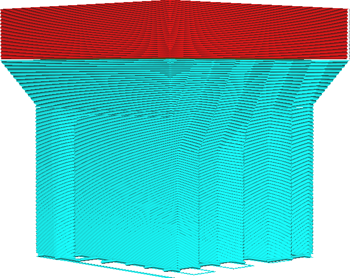

Minimální šířka kónické podpěry
====
Pokud je aktivována kónická podpěra a nastavena tak, aby zmenšila nosnou strukturu, toto nastavení určuje minimální šířku, na kterou se kónická podpěra zmenší. Podpora nebude ztenčena, pokud oblast převisu, která potřebuje podpěru, je užší.

Pokud velký objem podpěry spočívá na malém sloupku podpěry, bude tato podpěra velmi náchylná k převrhnutí. Zvětšení minimální šířky zvětšuje šířku základního nosného sloupku, ke kterému bude přitahován kužel. To zvyšuje spolehlivost tisku, ale bude to stát další materiál. Celkově bude kónická podpěra méně účinná při zkrácení doby tisku.