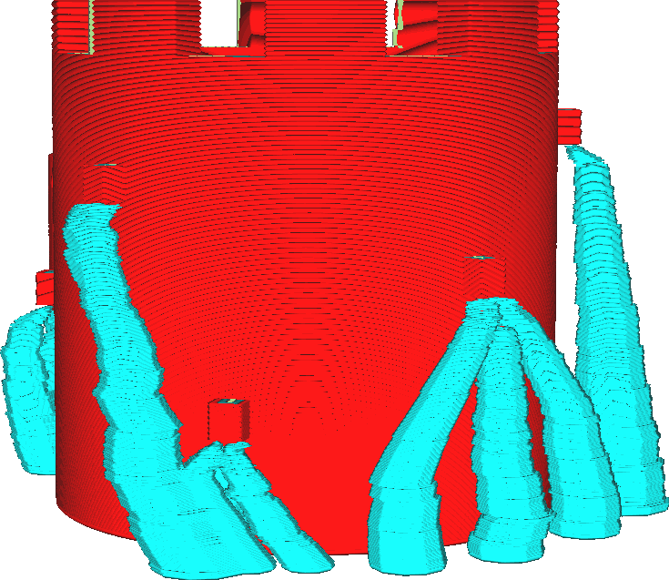

Rozlišení kolize stromové podpěry
====

Hlavní nevýhoda stromové podpěry spočívá v tom, že při aktivaci trvá dlouhou dobu, než se slicuje. Většina výpočtů potřebných ke stromové podpěře se týká větví stromu, aby se zabránilo kolizi se sítí. Tento parametr určuje přesnost těchto výpočtů vyhýbání se kolizi. Zvýšení tohoto rozlišení (nižší přesnost) ušetří spoustu času ve výpočtech, ale také způsobí, že podpěra bude vypadat roztřepeně, když je blízko sítě.

Technický kontext tohoto nastavení je následující. Aby se zabránilo kolizi s tištěným objektem, když je aktivována stromová podpěra, vypočítá Cura trojrozměrné objemy, do nichž není dovoleno středům větví stromu vstoupit. Jeden takový objem se počítá pro každý možný průměr větve stromu, což zabere hodně času. Počet možných průměrů větví se dramaticky zvyšuje s rostoucím stromem a s velkými hodnotami pro [Úhel průměru větví stromové podpěry](support_tree_branch_diameter_angle.md). Z tohoto důvodu je průměr zaokrouhlen na nejbližší násobek tohoto nastavení rozlišení. V některých bodech podél výšky stromu, se objem kolize větve potřebuje zabránit přichycení k dalšímu vzorku průměru větve, najednou dovoluje větvi více prostoru pro pohyb. Díky tomu bude strom vypadat rozeklaně.

Zvýšení tohoto nastavení způsobí, že slicer v aplikaci Cura zabere méně času. Rovněž to zajistí, že podpěra bude více roztřepená, to ohrožuje její sílu, čímž se zvyšuje pravděpodobnost, že se podpěra během tisku zlomí, což může způsobit selhání tisku.
