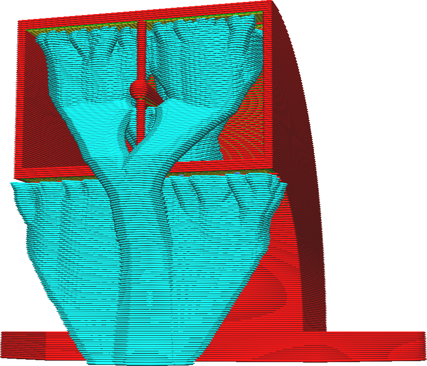

Stromová podpěra
====
Stromová podpěra nabízí alternativní přístup k podepření modelu než běžná podpůrná technika. Stromová podpěra vytváří rozvětvenou strukturu, která začíná na tiskové podložce s malou základnou, ale která se vyvíjí směrem k částem, které je třeba podepřít.

Stromové podpěry pomáhají vyhýbat se překážkám při růstu směrem k převislým oblastem. Je-li to možné, strom poroste z podložky tisku vzhůru, aby nedošlo ke zjizvení na povrchu, na kterém podpěra spočívá. Pokud to není možné, strom bude spočívat na povrchu modelu co nejblíže k převisu, aby se minimalizovala doba a spotřeba materiálu. Větve stromové podpěry jsou omezeny parametrem [Úhel větve stromové podpěry](support_tree_angle.md), takže pro sebe nevytvářejí příliš prudký převis. To omezuje schopnost růst kolem překážek a také určuje výšku, ve které se kmeny začnou větvit.

Ve výchozím nastavení je stromová podpěra dutá. Běžná nastavení podpěry však stále platí pro oblast ohraničenou větvemi stromu. Zejména hodnota parametru [Hustota podpěry] může být použita pro zvýšení nosnosti konstrukce. Protože povaha stromové podpěry je velmi nepravidelná, má obvykle svou tuhost, aby mohla plnit svou funkci.

Stromová podpěra má oproti běžné podpoře řadu výhod, abychom některé jmenovali:
* Stromová podpěra obecně používá mnohem méně materiálu než běžná podpěra. Typické je 25 až 50% použití materiálu. To šetří spoustu času a materiálu.
* Při tisku se stejným materiálem jako tisk má převis tendenci být s podpěrou ve tvaru stromu, estetičtější.
* Podpěra ve tvaru stromu je jednodušší odstranit než běžnou podpěru.
* Podpěra ve tvaru stromu zanechává na povrchu méně jizev než normální podpěra, protože se může natáhnout kolem modelu směrem k podložce tisku.

Má to však také některé nevýhody:
* U podpěry ve tvaru stromu trvá slicování řádově déle. Bude zapotřebí trpělivosti, zejména u vysokých modelů.
* Při tisku nejmenších větví dochází k mnoha přerušením, což způsobuje, že stromová podpěra není vhodná pro tisk s obtížně vytlačitelnými materiály, jako je PVA nebo flexibilní materiály.
* Stromová podpěra nepracuje velmi dobře pro podpěru některých mechanických modelů. Zejména má tendenci umísťovat příliš málo větví na podpěru plochých a nakloněných převisů.

Ačkoli stromová podpěra může být aktivována současně s běžnou podpěrou, není to obecně žádoucí. Oba typy podpěry se zkříží a způsobí nad-extruzi.
