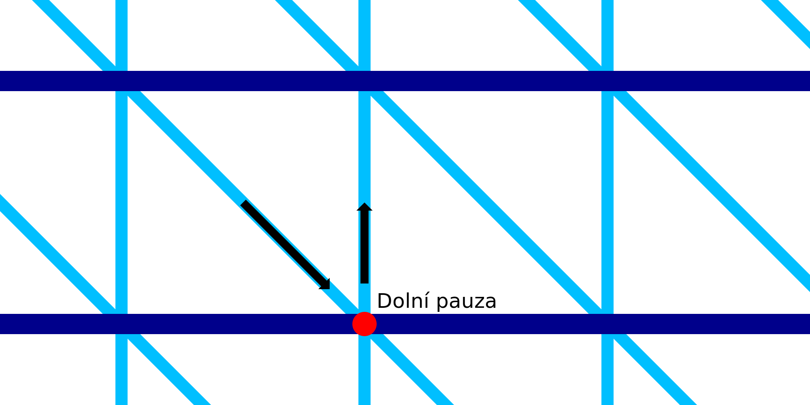

Pauza na spodu drátového tisku
====
Při tomto nastavení se tryska na okamžik zastaví po tisku diagonální linie dolů.

Když je tryska nehybná, vytéká trochu materiálu a vytváří tam kapku. Tato kapka pomáhá upevnit pilový vzor na vodorovný kroužek níže. Zvyšuje odolnost a spolehlivost tisku.

Přidání pauzy však výrazně zvyšuje dobu tisku. Existuje mnoho míst, kde se pak tryska zastaví.
