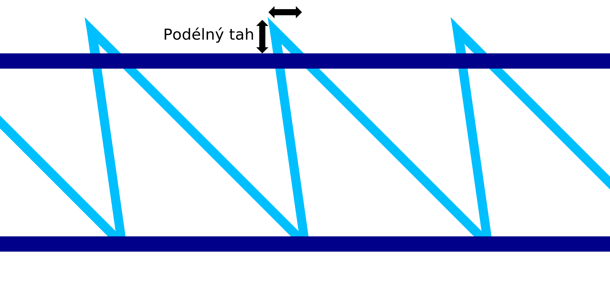

Podélný tah drátového tisku
====
Při diagonálním pohybu tisku pilového vzoru směrem dolů pro drátový tisk má materiál tendenci být trochu přetažen. Toto nastavení kompenzuje tento účinek mírnou změnou tvaru pilového zubu. Špičky zubů jsou vyvedeny nahoru a zpět.

Špičky zubů se pohybují přesně naproti diagonálnímu pohybu dolů. Když je materiál tažen, doufá se, že špičky zubů pily skončí na zamýšleném místě.

Při správném vyladění to způsobí, že se vzor pilových zubů tiskne přesněji. Výsledkem je, že další vodorovný prstenec, který se umístí na vrchol pilového vzoru, nebude tolik klesat, jako by jinak. Celá struktura bude silnější a tisk bude spolehlivější.
