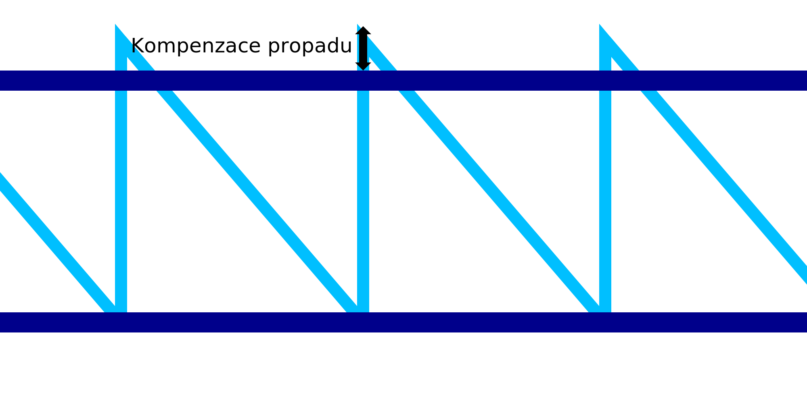

Propad drátového tisku
====
Při tisku drátového rámu se očekává, že se materiál z důvodu latentního tepla zhroutí dříve, než bude mít čas ztuhnout. Díky tomu by byl pilový vzor příliš krátký. Zatímco horizontální kroužky jsou schopny se překrývat, plynulým horizontálním pohybem, pilový vzor nemůže. Toto nastavení kompenzuje krátkou velikost pilového vzoru, vzor je o něco vyšší, takže další vodorovný kroužek na něm správně spočívá.

Nastavená hodnota se připočítává k výšce zubů pily. Doufejme, že to kompenzuje prověšení při tisku těchto zubů. Při správném vyladění bude vodorovný kroužek natištěn pevně na horní straně pilového vzoru, místo aby klesal dolů, více než je zamýšlená výška tisku.

Při kombinaci s [podélným tahem](wireframe_drag_along.md) se výška vzoru pilového vzoru stane normální [výškou](wireframe_height.md) plus hodnota nastavení podélného tahu plus hodnota tohoto nastavení.