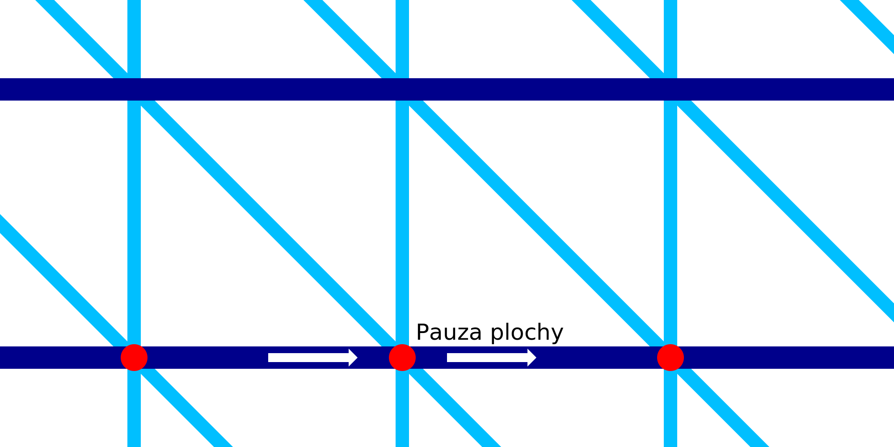

Horizontální pauza drátového tisku
====
Během tisku vodorovných prstenců drátového rámu se tryska zastaví na zlomek sekundy v každém segmentu linie. Toto nastavení umožňuje nakonfigurovat délku této pauzy. Pauza se nachází přesně tam, kde se vodorovný kroužek připojuje k pilovému vzoru níže.

Při úplném zastavení a pozastavení se v místě, kde se tryska zastaví, objeví malá kapka vytékajícího materiálu. Tlak toku materiálu opouštějící komoru trysky bude také tlačit horizontální kroužek mírně dolů. Kroužek je tedy velmi dobře připojen k pilovému vzoru umístěnému níže.

Pauza výrazně zvyšuje celkovou dobu tisku. Existuje mnoho míst, kde je tryska pozastavena.
