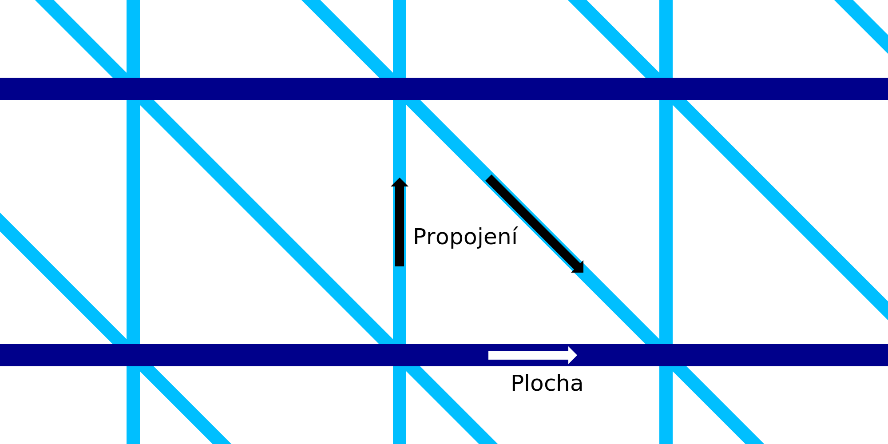

Tok pro propojení drátového tisku
====
Toto nastavení umožňuje konfigurovat průtok (a tedy tloušťku drátů) stoupajících a sestupných spojovacích drátů ve struktuře drátového rámu. Lze ho konfigurovat odděleně od vodorovných kroužků.

Zvýšený tok způsobuje, že dráty jsou silnější. Díky tomu jsou spojení pevnější, jakmile ztuhnou. To však také zvyšuje tepelnou hmotnost drátů, což způsobuje, že ztuhnutí trvá déle. To snižuje spolehlivost tisku, protože de dráty již nemusí správně připojit.
