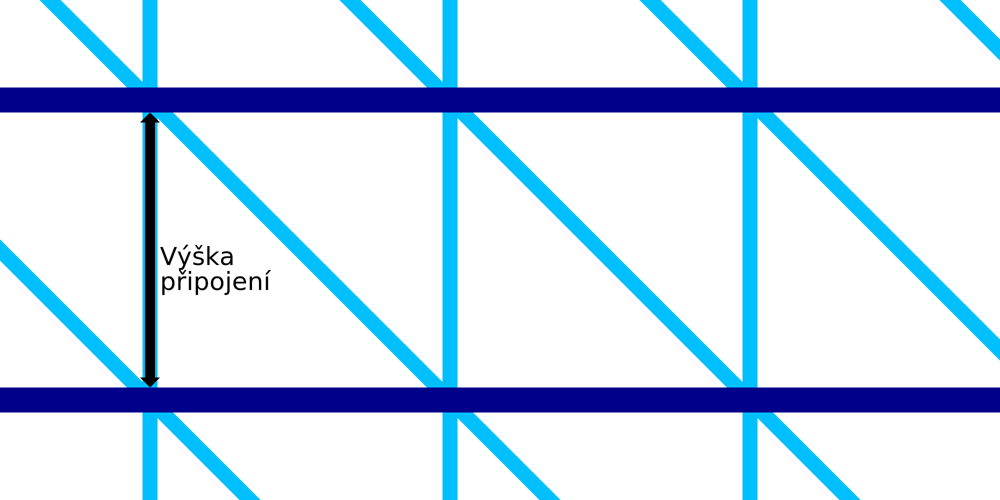

Výška připojení pro drátový tisk
====
Drátový tisk zahrnuje tisk několika kroužků kolem obrysu. Toto nastavení určuje vertikální rozteč kroužků. S tímto nastavením můžete definovat délku spojení mezi dvěma soustřednými kroužky.

Kroužky jsou spojeny pilovým vzorem. Skládá se jak z vertikální linie, tak z diagonální linie. Svislá čára bude přesně délka spojení. Úhlopříčka bude nakloněna pod úhlem 45°. Toto nastavení proto určuje nejen vertikální výšku mezi kroužky, ale také horizontální velikost pilového vzoru. Obecně určí hustotu rámce.

Snížení výšky způsobí, že rám bude hustší. Díky tomu bude rám stabilnější a tisk bude spolehlivější. Tisk však také bude trvat déle.