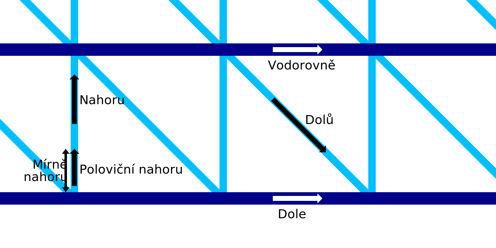

Rychlost drátového tisku vodorovně
====
Toto nastavení určuje rychlost, jakou se tryska pohybuje vodorovně během tisku vodorovných prstenců drátového rámu. Rychlost vodorovných linií může být konfigurována odděleně od zbytku rychlosti drátového tisku.

Nejnižší vodorovná vrstva bude vytištěna [dolní rychlostí](wireframe_printspeed_bottom.md). Tu lze nakonfigurovat samostatně.

Pomalejší tisk bude trvat déle, ale dává materiálu více času na ztuhnutí. To zlepšuje schopnost přemostění materiálu, díky čemuž je tisk na konci spolehlivější a lépe vypadající.