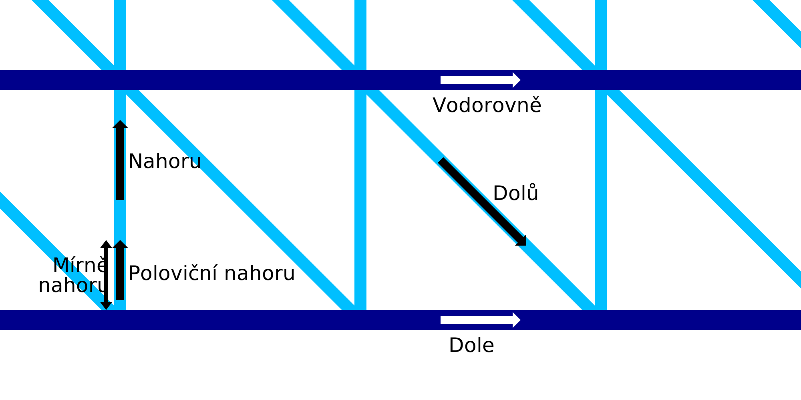

Rychlost drátového tisku nahoru
====
Toto nastavení určuje rychlost, jakou se bude tryska pohybovat vzhůru při vertikálním pohybu při konfiguraci pilového vzoru. Rychlost pohybu nahoru může být konfigurována odděleně od zbytku rychlosti drátového tisku.

Pohyb nahoru nebude mít rychlost specifikovanou pro celý pohyb. Pro nejnižší část pohybu nahoru, jak je definován parametrem [Odchylka rychlosti drátového tisku nahoru](wireframe_up_half_speed.md), se tisková hlava pohybuje poloviční rychlostí.

Pomalejší pohyb nahoru bude trvat déle, ale poskytne materiálu více času na zpevnění. Tímto způsobem nebude tolik natahován ve směru úhlopříčky. Příliš pomalý pohyb však bude také tlačit linii dolů kvůli setrvačnosti vlákna s tlakem v komoře trysky. Vlákno pak má sklon ke kmitání, takže je méně pravděpodobné, že další vodorovná linie může navázat správné spojení.