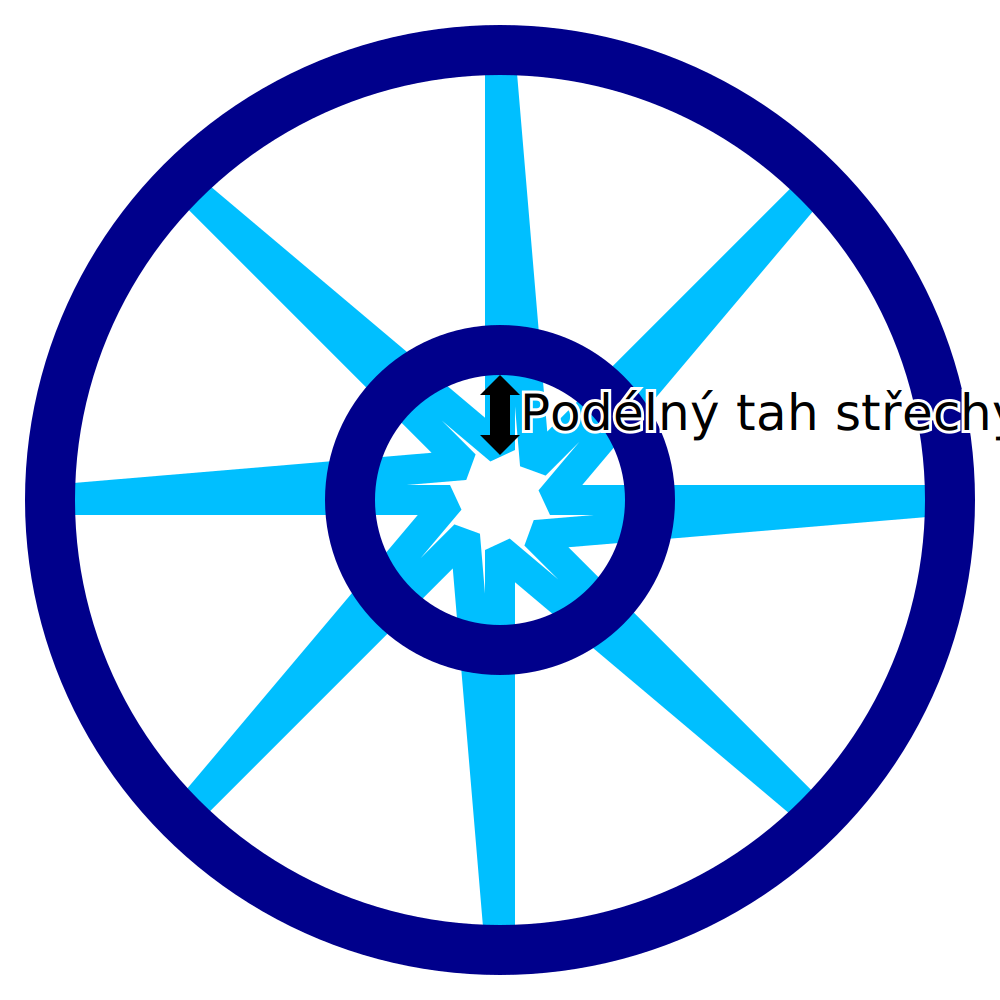

Podélný tah střechy drátového tisku
====
Při tisku roztaveného plastu má tryska tendenci táhnout část materiálu spolu s jejím pohybem, dokonce i po jeho vytlačení. Tento efekt je ještě silnější při tisku ve vzduchu na střechu drátěného rámu při tisku v režimu drátového tisku. Toto nastavení způsobí, že vzor pilového zubu v horní části tisku bude pokračovat poněkud hlouběji dovnitř, aby se kompenzovalo jeho tažení tryskou.

Toto nastavení způsobí, že vnitřní špičky vzoru pilového zubu se na horní straně tisku budou posouvat dále dovnitř. Špičky se pohybují v přesném opačném směru než úhlopříčky, které se pohybují směrem ven, narozdíl od přímek, které se pohybují směrem dovnitř.

Účelem tohoto nastavení je při pečlivém vyladění zlepšit připojení vnitřních špiček vzoru pilového zubu k soustřednému kroužku, který je vytištěn, aby na nich spočíval.