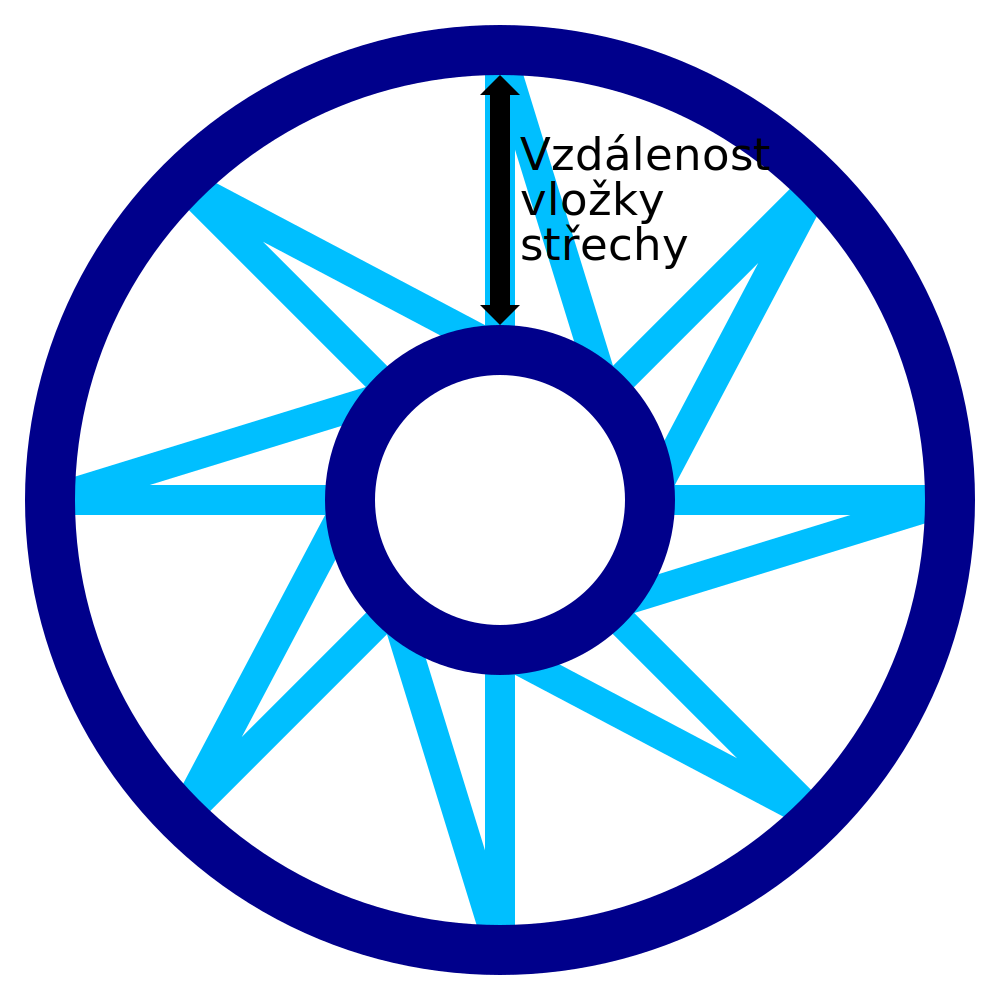

Vzdálenost střešní vložky pro drátový tisk
====
Pokud je povrch modelu vodorovný, například horní plocha modelu, vytiskne se řada soustředných prstenců a připojí se k pilovému vzoru. Toto nastavení určuje vzdálenost mezi těmito soustřednými kroužky.

Mezi každou soustřednou vložkou je nakreslen pilový vzor. Pilový vzor bude mít nejen výšku určenou tímto nastavením, ale také základní šířku pilového vzoru. Úhlopříčka bude umístěna ve vzdálenosti od základny přímky, jak ukazuje toto nastavení na nejvnitřnějším prstenci. Toto nastavení tedy označuje celkovou hustotu vzoru střechy, nejen vzdálenost mezi vložkami.

Zmenšením tohoto nastavení se koncentrické vložky přiblíží a zvýší se obecná hustota vzoru. Tím se snižuje vzdálenost, kterou musí materiál přemostit, když přechází přes vrchol modelu. To zvyšuje spolehlivost a zvyšuje šance na vytvoření správného spojení mezi každou vložkou.
