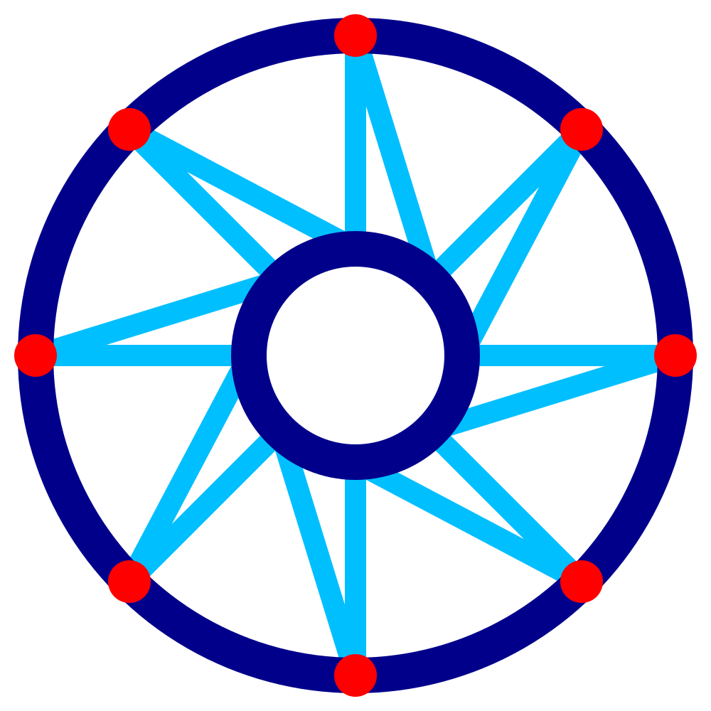

Pauza vně střechy drátového tisku
====
S tímto nastavením můžete nakonfigurovat trysku tak, aby se na krátkou chvíli pozastavila, pokaždé, když narazí na vnější obrys, při tisku vzoru pilového zubu na střeše drátového rámu.

Když je tryska nehybná, vytváří v místě, kde je pozastavena, kvůli prosakování malou kapku. Tato kapka zlepšuje spojení mezi vzorem pilového zubu a konturou kolem něj.

Pozastavení zabere značné množství času tisku, protože se tryska zastaví na mnoha místech.