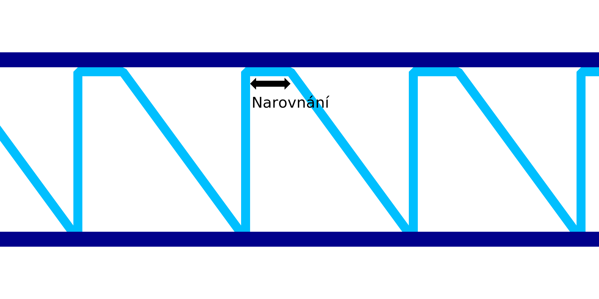

Narovnat sestupné linie drátového tisku
====

Toto nastavení je dalším kompenzačním faktorem, který lze použít ke kompenzaci prověšování materiálu během drátového tisku. Namísto přímého pohybu diagonálně směrem dolů pro vzor pilového zubu toto nastavení způsobí, že se tryska, po stanovenou délku drátu, bude pohybovat vodorovně a potom se bude pohybovat směrem dolů.

Přímý vodorovný pohyb je určen k mírnému vytažení materiálu před pohybem dolů. Při správném naladění to způsobí, že materiál klesá v rovné úhlopříčce a ne v prohnuté křivce. Díky tomu je vzor pily a zubu silnější a také umožňuje, aby se špičky zubů lépe postavily na podporu dalšího vodorovného prstence.