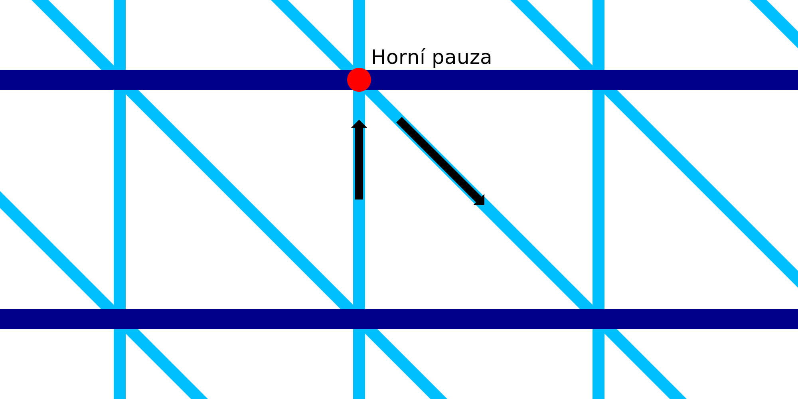

Pauza na vrcholu drátového tisku
====
Při tomto nastavení se tryska, po vytištění stoupající čáry, na okamžik zastaví.

Zatímco tryska v horní části stoupající linie zůstává nehybná, má stoupající linie čas ztuhnout. Tím se zabrání tomu, aby byla tryskou stržena, když začne znovu klesat.

Samozřejmě přidání prodlevy značně prodlužuje dobu tisku. Při zastavení může teplo z trysky také roztavit materiál a vytékat z horní strany. To přidá kapku roztaveného materiálu do jediné řady vláken, což činí tuto linii trochu těžší.

Tato úprava přidává do stopy konglomerát faktorů, které je obtížné předvídat. Přesný dodací čas, který nejlépe vyhovuje vašemu materiálu, tiskárně a modelu, by měl být stanoven experimentálně. Obecně platí, že zvýšení zpoždění v rozumných mezích má obvykle pozitivní dopad na spolehlivost tisku, ale velký negativní dopad na rychlost tisku.
