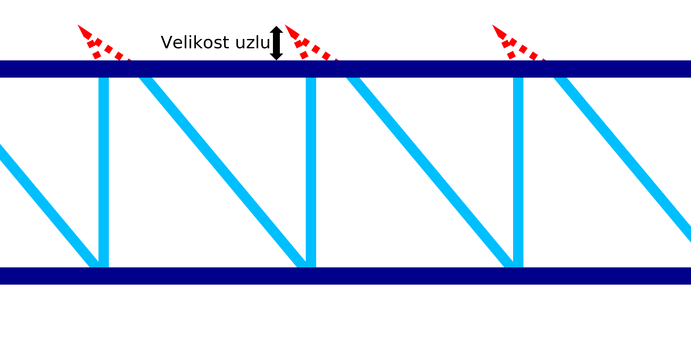

Velikost uzlu drátového tisku
====
Pokud je [Strategie drátového tisku](wireframe_strategy.md) nastavena na "Uzel", bude v horní části každého pilového zubu proveden malý pohyb shora dolů a zdola nahoru. Toto nastavení umožňuje nakonfigurovat rozsah tohoto pohybu.

Pohyb pro tento "uzel" je řada přesunů:
1. Nejprve se tryska posune směrem nahoru, jak ukazuje toto nastavení. Současně se tryska pohybuje o polovinu zpět.
2. Pokud je v horní části [pauza](wireframe_top_delay.md), tryska se zastaví po dobu nastavené pauzy. Toto přerušení se koná ve špičce pohybu uzlu.
3. Tryska klesá do obvyklé výšky. Současně se tryska posune o jedenapůlnásobek velikosti uzlu, aby se ocitla ve vzdálenosti uvedené v tomto nastavení vzhledem ke svislé linii.

Účelem uzlu je poskytnout vodorovnému kroužku, který má být připevněn k pilovému vzoru, určitý povrch. Uzel se ze strany na stranu mírně mění, takže pokud není horizontální kroužek umístěn přesně, existuje větší šance, že se k sobě připojí. Uzel také způsobí, že horní linie se bude rozprostírat o něco více nahoru, což způsobí, že horizontální kroužek bude na něj přitlačen. Nakonec uzel také způsobí určitý výtok kvůli absenci retrakce v tomto pohybu přesunu. Tím se vytvoří kapka, na které může horizontální kroužek lépe spočívat.