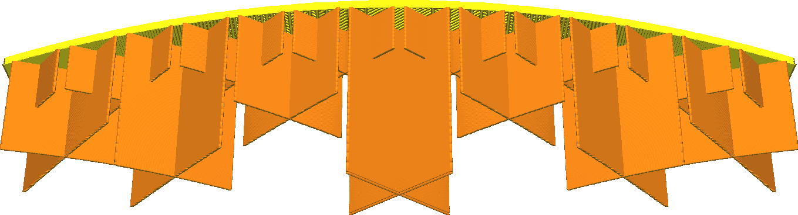

Postupné kroky výplně
====
Postupná výplň snižuje množství použitého materiálu a snižuje hustotu výplně ve spodních vrstvách. To šetří čas a tiskový materiál, aniž by se výrazně snížila kvalita povrchu. Hlavním účelem výplně při tisku pro vizuální kvalitu je podpora horní plochy. Tato vlastnost umožňuje koncentraci výplně pro tento jediný účel.

Tento parametr udává, v jakých fázích je hustota výplně snížena. V každé fázi se hustota výplně sníží na polovinu. Například počínaje procentem plnění 20% a dvěma stupni postupné výplně bude hustota výplně dolních částí 10%, respektive 5%.

**Zaškrtávací pole "Postupná výplň" v doporučeném režimu nastavuje tento parametr na 5 kroků a zvyšuje hustotu výplně na 90%. Výsledkem je velmi vysoká hustota v horní části (90%) a velmi nízká hustota v dolní části vašeho tisku (2,8%).**