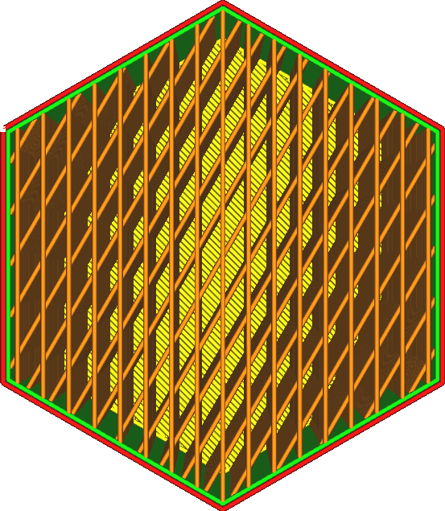

Směr linií výplně
====
Linie výplně jsou obvykle orientovány v úhlu 45 stupňů, pokud je to možné. V tomto úhlu spolupracují motory X a Y k dosažení maximálního zrychlení tiskové hlavy při použití tiskárny se společným kartézským portálovým mechanismem.

Toto nastavení umožňuje tento úhel upravit. Můžete ho specializovat, abyste vytvořili větší sílu pro váš konkrétní model nebo získali větší akceleraci pro váš konkrétní portálový systém (např. pro tiskárny delta).

Hodnota tohoto parametru musí být seznam úhlů oddělených čárkami a uzavřený hranatými závorkami. Úhel 0 stupňů poskytne linii rovnoběžnou s osou Y. Seznam úhlů se bude ve vrstvách střídat.
* Konečný tisk bude nejsilnější ve směru linie výplně. Pokud potřebujete, aby tisk nesl určitou sílu ve vodorovném směru, je užitečné orientovat linie výplně kolem tohoto směru.
* Chcete-li použít výchozí hodnotu, ponechte konfigurační seznam prázdný.
* Výchozí hodnota závisí na vzoru výplně:
 * Pro křížový a 3D křížový vzor výplně je výchozí hodnota [22]. To umožňuje orientovat co nejvíce linií v blízkosti diagonál.
 * Pro lineární a cikcak vzory výplně je výchozí hodnota [45,135]. Toto střídá orientaci vrstvy po vrstvě mezi dvěma úhlopříčkami.
 * Všechny ostatní vzory používají výchozí hodnotu [45]. To umožňuje orientovat co nejvíce linií v blízkosti diagonál.