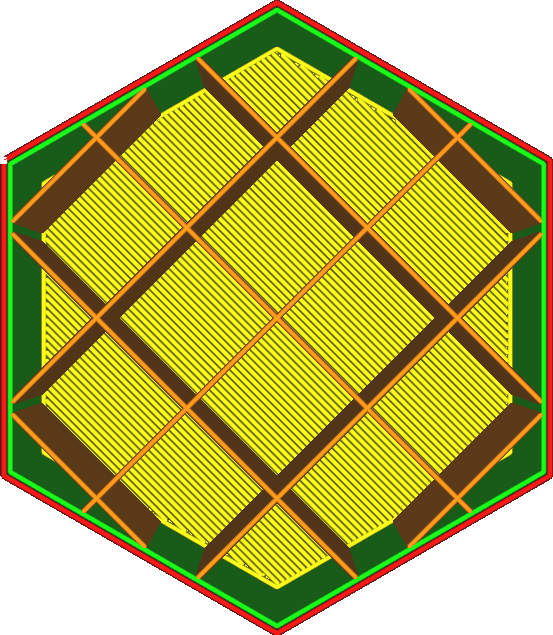

Vzdálenost linií výplně
====
Místo nastavení parametru [Hustota výplně](infill_sparse_density.md) v procentech je také možné nakonfigurovat hustotu výplně definováním vzdálenosti mezi sousedními liniemi výplně. Větší vzdálenost mezi liniemi výplně povede k nižší celkové hustotě výplně.

Vzdálenost mezi liniemi výplně je jiný způsob pohledu na tuto vlastnost než hustota. Vzdálenost mezi liniemi výplně udává vzdálenost, kterou musí horní povrchové linie cestovat z jedné linie výplně do druhé. Zmenšení vzdálenosti mezi liniemi výplně proto snižuje překlenovací vzdálenost a zlepšuje kvalitu horních povrchů.

Obvykle se vzdálenost linií výplně počítá z požadované hustoty výplně v závislosti na vybraném vzoru výplně a šířce linie. Vzdálenost linií výplně je vedoucí.

Zvýšení hustoty výplně (zmenšením vzdálenosti mezi liniemi) má důležitý vliv na váš tisk, a to:
* Váš tisk bude silnější.
* Horní povrch bude lépe podepřen, díky čemuž bude hladší a vodotěsnější.
* Snížení polštářování, protože tepelné kapsy budou menší.
* Váš tisk bude vyžadovat více materiálu, a proto bude těžší.
* Tisk trvá déle.