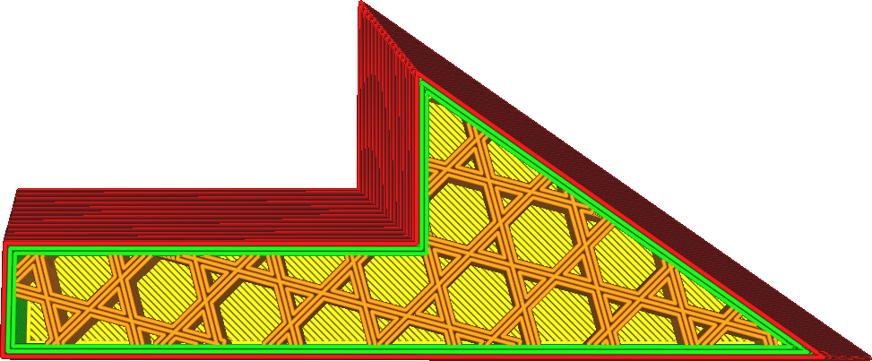

Násobitel linií výplně
====
Zvýšením tohoto nastavení umístí Cura další linie výplně přímo vedle ostatních linií výplně.

Tím se účinně zvyšuje hustota výplně nad rámec toho, co určuje parametr [Hustota výplně](infill_sparse_density.md), ale místo rovnoměrného rozložení výplňových linií jsou linie umístěny přímo vedle sebe. Ve srovnání s jednoduchým zvýšením hustoty výplně to může zvýšit odolnost výplně, protože linie výplně mohou na sobě spočívat pro zvýšení tuhosti.

Když je nastaven lichý násobitel, zůstanou původní linie výplně na svém místě, ale další linie výplně se opakují kolem otvorů ve vzoru výplně. Když je nastaven sudý násobitel, jsou původní linie výplně odstraněny a smyčky jsou umístěny přímo na jejich místo.

Ve srovnání s alternativou zvýšení hustoty výplně stejným násobitelem bude mít na váš tisk určité efekty.
* Výplň se stává celkově tužší, stejně jako když se zvětšení šířka linie výplně, protože linie výplně mohou na sobě spočívat, když jsou vystaveny střižným silám.
* Výplň bude více prosvítat přes plášť, čímž se sníží kvalita povrchu.
* Mezery mezi liniemi výplně jsou větší, protože linie jsou k sobě těsnější. Plášť je proto více prohnutý a umožňuje polštářování.

**Toto nastavení nemá žádný vliv, pokud je hustota výplně 100% nebo více.**
