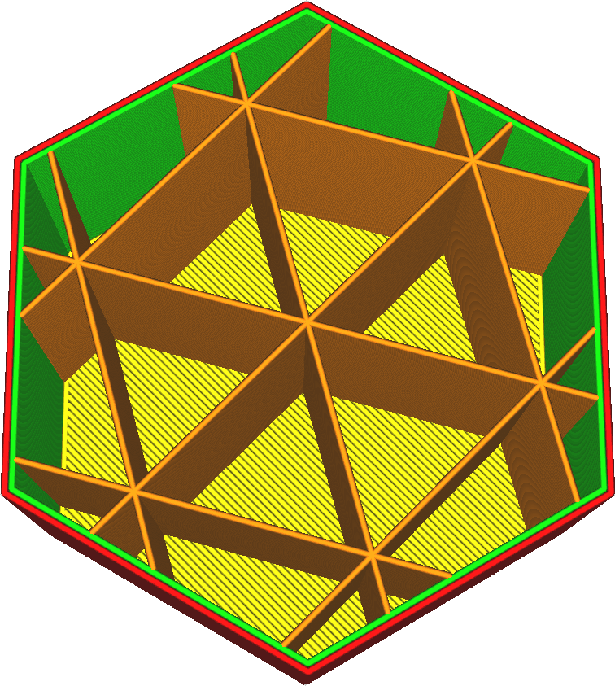
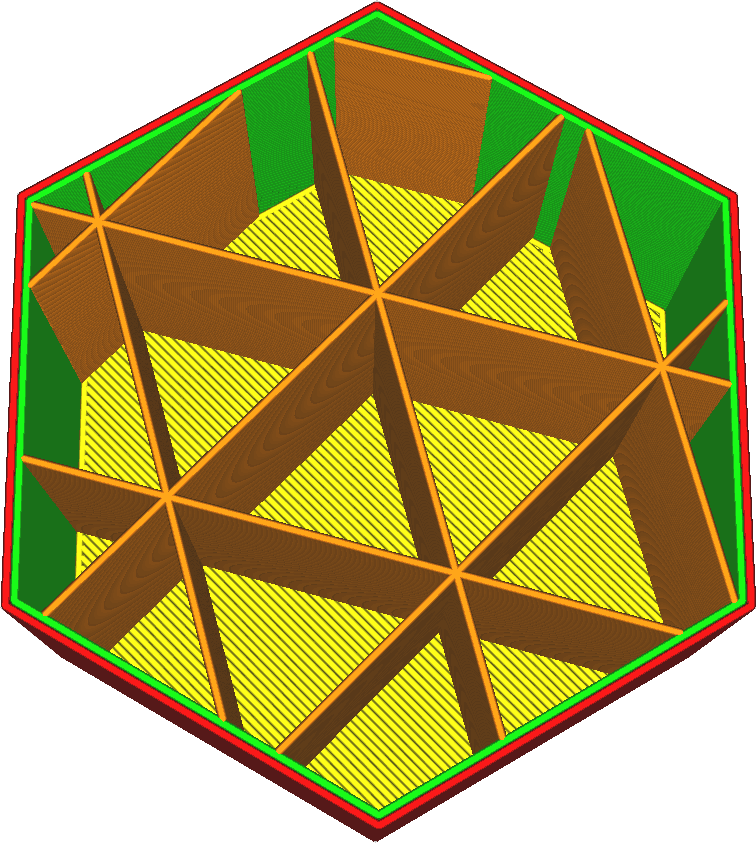

Odsazení výplně ve směru Y
====
Normálně jsou vzory výplně vycentrovány na střed 3D modelu. Tento parametr, stejně jako [Odsazení výplně ve směru X](infill_offset_x.md), umožňuje přesunout střed vzoru. Tento parametr upravuje souřadnici Y středu.

Při tisku s nízkou hustotou výplně ji můžete použít k velmi přesnému umístění výplně tak, aby jednotlivé linie výplně byly umístěny tam, kde je nejvíce zapotřebí pevnosti.