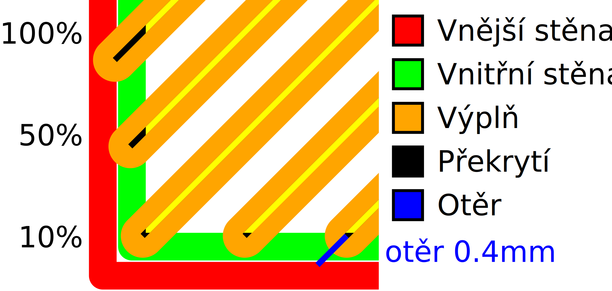

Překrytí výplně
====
Pokud se výplň trochu překrývá se stěnami, přilne lépe ke stěnám, díky čemuž bude součást mnohem pevnější. Toto nastavení řídí stupeň překrytí mezi výplní a stěnami.

* Díky zvýšenému překrytí se výplň lépe drží na stěnách, což vede k pevnější části.
* Vytvoří však také prosvítání výplně přes stěny, což povede ke vzoru povrchu tisku. Tím se snižuje vizuální kvalita povrchu.