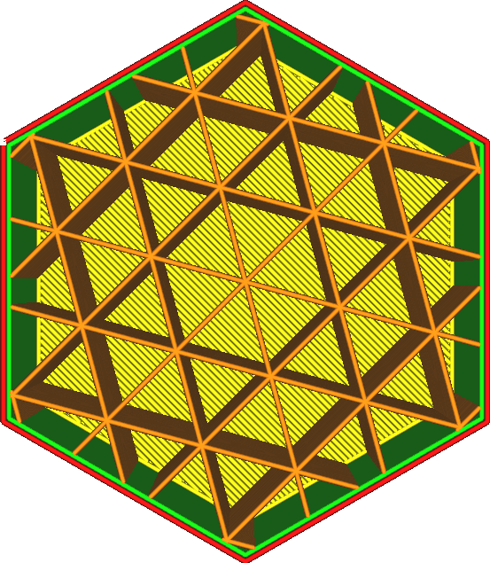

Vzor výplně
====
Vzor výplně definuje strukturu, která se používá k vyplnění objemu objektu. Existuje několik vzorů, z nichž každý má své vlastní výhody. Některé se specializují na velmi specifické aplikace.

Mřížkový
----

Vzor výplně mřížka vytvoří dvě sady kolmých linií. Společně tvoří vzor čtverců.
* Nejsilnější vzor ve svislém směru.
* Dost silný v obou směrech linií.
* V diagonále není tak silný.
* Velmi dobrá podpěra horní plochy. Váš povrch bude vypadat velmi hladce.

Lineární
----

Lineární vzor vytváří rovnoběžné linie. Ve výchozím nastavení vzorec linií mění svůj směr kolmo z jedné vrstvy na druhou, takže na první pohled vypadá jako vzor mřížky. Tento vzhled je však možné upravit pomocí parametru [Směr linií výplně](infill_angles.md).
* Nejlepší vzor pro hladký horní povrch stejně jako vzor cikcak, protože vzdálenost mezi liniemi je nejmenší.
* Ve svislém směru bývá slabý, protože vrstvy mají mezi sebou pouze malé spojovací body.
* Bude extrémně slabý v horizontálním směru, s výjimkou jediného směru, kde jsou orientovány linie. Ale ani v tomto směru není odolný vůči střihu, takže při zatížení poměrně rychle selže.

Trojúhelníkový
----

Trojúhelníkový vzor vytváří tři sady linií ve třech různých směrech. Společně to tvoří vzor trojúhelníků.
* Velmi odolný proti střihu.
* Pevnost je zhruba stejná v každém horizontálním směru.
* Horní linie by měla být dostatečně dlouhá, což vyžaduje mnoho vrstev pláště, aby se získal rovnoměrný horní povrch.
* Tok je na křižovatkách významně přerušen, což má za následek relativně nízkou pevnost při vysokých rychlostech plnění. Tok je na křižovatkách významně přerušen, což má za následek relativně nízkou pevnost při vysokých rychlostech plnění.

Trihexagonální
----

Trihexagonální vzor vytváří tři sady linií ve třech různých směrech, stejně jako trojúhelníkový vzor, ale vzájemně se odsazují, takže se všechny nekříží ve stejné pozici.
* Nejsilnější vzor v horizontálním směru.
* Pevnost je zhruba stejná ve všech horizontálních směrech.
* Velmi odolný proti střihu.
* Horní linie musí být velmi dlouhá, což vyžaduje mnoho horních vrstev pláště, aby se získala rovnoměrná horní vnější plocha.

Krychlový
----

Krychlový vzor vytváří krychle, trojrozměrný vzor. Krychle jsou orientovány svisle postaveny na rohu, což je umožňuje tisknout bez převislých vnitřních povrchů.
* Přibližně stejná síla ve všech směrech, včetně vertikálního směru.
* Docela silný ve všech směrech.
* Snížený efekt polštářů, protože nevytváří dlouhé vertikální kapsy horkého vzduchu.

Kubické členění
----

Vzor kubického členění vytváří krychle, trojrozměrný model. Krychle jsou orientovány svisle stojící na rohu, což je umožňuje tisknout bez přetékání vnitřních povrchů. Tento vzor však vytváří větší krychle směrem dovnitř objemu, což šetří materiál. Vynechává plnicí linie v místech, kde jsou nejméně užitečné.

Tento vzor může produkovat nižší hustoty výplně, než je požadováno. Při použití tohoto vzoru je vhodné výrazně zvýšit hustotu výplně. Optimalizace funguje nejlépe při vysokých poměrech výplně.

Algoritmicky je tento model vytvořen vytvořením obří krychle kolem celého svazku a poté, když se dotkne jakékoli stěny, rozdělí ji na 8 dílčích krychlí. Toto se pak opakuje, takže sub-krychle, které se dotýkají kterékoli stěny, jsou znovu a znovu rozděleny. Toto se opakuje, dokud není dosaženo vzdálenosti výplně.
* Nejsilnější vzor podle hmotnosti a doby tisku.
* Pevnost je zhruba stejná ve všech směrech, včetně vertikálního směru.
* Koncentrovaná výplň na jemné kousky.
* Účinek polštářů je snížen, protože nevytváří dlouhé svislé kapsy horkého vzduchu.
* Při použití zvýšené hustoty výplně, výplň příliš neprosvítá stěnami, což vede k lepší kvalitě povrchu při stejné době tisku.
* Zavádí retrakce, které s pružnými nebo řídkými materiály nefungují dobře.
* Slicování trvá déle.

Oktetový
----

Oktetový vzor vytváří kombinaci pravidelných čtyřstěnů a krychlí, trojrozměrného vzoru. Čas od času je vedle sebe umístěno několik linií výplně.
* Vytvoří pevný vnitřní rámeček, kde se dotýká několik paralelních linií. Zatížení se rychle rozptýlí směrem k tomuto vnitřnímu rámu.
* Silný na modelech s průměrnou tloušťkou asi jeden centimetr.
* Snížený efekt polštáře, protože nevytváří dlouhé vertikální kapsy horkého vzduchu.
* To má za následek velmi dlouhou překlenovací vzdálenost pro horní plášť, což snižuje kvalitu horního povrchu.

Čtvrť krychlový
----

Čtvrť krychlový vzor vytváří trojrozměrnou mozaiku složenou ze čtyřstěnů a zkrácených čtyřstěnů. Čas od času je vedle sebe umístěno několik linií výplně.
* Vytvoří dva oddělené interní rámečky podobné oktetu, kde se dotýká více rovnoběžných linií. Zatížení je rychle rozptýleno směrem k tomuto vnitřnímu rámečku. Rámečky jsou orientovány ve dvou různých směrech, což je činí jednotlivě slabšími, ale zmenšují vzdálenost k rozdělení zátěže na tyto rámečky.
* Silný na modelech tenkých několik milimetrů.
* Snížený efekt polštáře, protože nevytváří dlouhé svislé kapsy horkého vzduchu.
* To má za následek velmi dlouhou překlenovací vzdálenost pro horní plášť, což snižuje kvalitu horního povrchu.

Soustředný
----

Soustředný vzor vytváří kruhy rovnoběžné se stěnami.
* Nejsilnější vzor výplně při použití 100% výplně, protože nejen že se nepřekrývají žádné linie, ale linie jsou také orientovány tak, aby neizotropická síla linií distribuovala zatížení.
* Vytváří nejflexibilnější výtisky s velmi nízkou a rovnoměrnou silou ve všech horizontálních směrech.
* Silnější ve svislém než ve vodorovném směru.
* Při hustotě 100% by se materiál mohl uprostřed shlukovat, což by snížilo spolehlivost tisku kulatých tvarů, kde se soustředné kruhy setkávají v jednom bodě.
* U některých tvarů by některé linie výplně mohly viset ve vzduchu, což by zvyšovalo náklady na materiál a dobu tisku.
* Pokud nepoužíváte 100% výplň, jedná se o nejslabší výplň v horizontálním směru. Nepřidává žádnou pevnost.

Cikcak
----

Vzor cik-cak způsobuje, že tryska kreslí klikaté linie. Je to jako lineární vzor, ale linie jsou spojeny do jedné dlouhé linie, která zabraňuje přerušení toku.
* Je druhým nejsilnějším vzorem výplně, když používá 100% plnění. Je však spolehlivější než soustředné kruhové výplně.
* Nejlepší vzor pro hladký povrch s cikcak, protože vzdálenost mezi liniemi je nejmenší.
* Ve svislém směru bývá docela slabý, protože vrstvy mají mezi sebou pouze malé body spojení.
* Bude extrémně slabý v horizontálním směru, s výjimkou jediného směru, ve kterém jsou linie orientovány. Ale ani v tomto směru není odolný vůči střihu, takže při zatížení poměrně rychle selhává. 

Křížový
----

Vzor křížové výplně vytváří křivku výplně prostoru, která vytváří něco jako kříže podél vnitřku objemu.
* Křivka je rovnoměrně vlnitá ve všech horizontálních směrech, což ho činí užitečným pro tisk měkkých a flexibilních objektů.
* Nevytváří žádné dlouhé přímé linie v horizontálním směru, což tento vzor rovnoměrně zakřivuje po celém obvodu. Nejsou ta žádná silná místa.
* Žádné retrakce, což usnadňuje tisk s pružnými materiály.
* Bude silnější ve svislém směru než ve vodorovném směru.
* Slicování trvá dlouho.
* Bude velmi slabý ve všech horizontálních směrech.

3D křížový
----

3D křížový vzor výplně vytváří křivku vyplňující prostor, která vytváří něco, co vypadá jako kříže podél vnitřku objemu. Tento vzor pulzuje podél osy Z, aby se oslabil ve svislém směru.
* Tento vzor je proto nejužitečnější pro tisk měkkých a flexibilních objektů.
* Nevytváří dlouhé přímé linie, díky nimž je rovnoměrně rozložen po celé ploše.
* Žádné retrakce, což usnadňuje tisk s pružnými materiály.
* Slicování trvá dlouho.
* Bude velmi slabý ve všech směrech. 

Gyroid
----

Vzor výplně Gyroid vytváří vlnitý vzor, který mění směr.
* Vytváří objem, který je zcela propustný pro kapaliny, což z něj činí užitečný model pro rozpustné materiály.
* Stejně silný ve všech směrech, ale ne příliš. To je užitečné pro flexibilní materiály, ale výsledek bude o něco těžší, méně zvlněný, než vzory (3D) křížové výplně.
* Odolný proti střihu.
* Slicování trvá dlouho a vytváří velké soubory g-kódu. U některých tiskáren může být obtížné sledovat mnoho příkazů g-kódu za sekundu a může být obtížné držet krok přes sériové připojení při nízkých přenosových rychlostech.

